# 1. 简介和概述

## 1.1 操作系统（Operating System, OS）

`概念`：`控制`和`管理`整个计算机系统的`硬件和软件资源`，并合理组织调度计算机的工作和资源的分配；以`提供给用户和其他软件方便的接口和环境`；是计算机系统中最基本的`系统软件`。

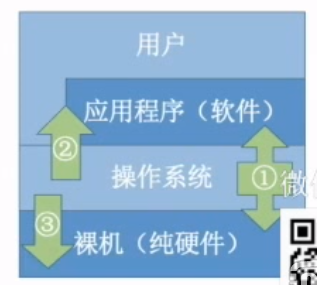

功能：
1. 系统资源的管理者
    - 功能
        1. 处理器管理
        2. 存储器管理（`内存管理`）
        3. 文件管理
        4. 设备管理
    - 目标：安全、高效
2. 向上层提供更方便易用的服务
    1. 供用户直接使用的
        - GUI
        - 联机命令接口——交互式命令接口（cmd）——单条命令
        - 脱机命令接口——批处理命令接口（.bat）——脚本
    2. 供程序使用的
        - 程序接口（系统调用）
3. 是最接近硬件的一层软件
    - 需要实现对硬件机器的拓展（通过软件）——扩充机器

操作系统内核是操作系统最重要最核心的部分，也是最接近硬件的部分，由很多内核程序组成。

## 1.2 操作系统的特征

操作系统的特征：
1. `并发`
2. `共享`
3. 虚拟
4. 异步

其中，`并发`和`共享`，是操作系统的两个基本特征，两者互为存在条件。

### 1.2.1 并发

`并发`：两个或多个事件在`同一时间间隔内发生`。这些事件`宏观上是同时发生的`，但`微观上是交替发生`的。

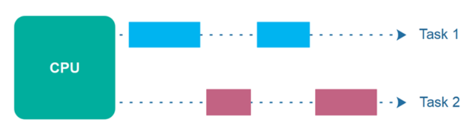

并发vs并行

`并行`：两个或多个事件在`同一时刻同时发生`。

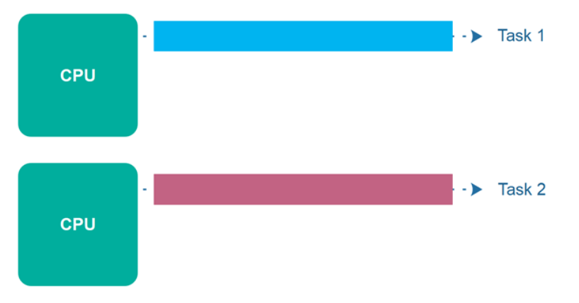

注意：
1. 单核CPU同一时刻只能执行一个程序，各个程序只能并发地执行
2. 多核CPU同一时刻可以同时执行多个程序，多个程序可以并行地执行

`操作系统是伴随着多道程序技术而出现的，因此，操作系统和程序并发是一起诞生的。`

### 1.2.2 共享

`共享`：即资源共享，是指系统中的资源可供内存中多个并发执行的进程共同使用。可分为
1. 互斥共享方式——系统中的某些资源，虽然可以提供给多个进程使用，但`一个时间段内只允许一个进程访问该资源。`，例子：QQ微信争抢摄像头资源
2. 同时共享方式——系统中的某些资源，`允许一个时间段内由多个进程同时对它们进行访问。`，例子：扬声器可以同时播放音乐和游戏声音。

并发性、共享性关系解释：

1. 只有满足并发性时才需要共享性——若不满足并发性，则所有程序都是串行执行，因此不存在多个程序同时运行，进行进行资源访问的情况，因此，不需要共享性的支持。
2. 只有满足共享性，并发性才能实现——若不满足共享性，则只能有一个程序访问资源，如此，许多程序就无法并发运行，只能串行运行。

### 1.2.3 虚拟

`虚拟`：是指把一个物理上的实体变为若干个逻辑上的对应物。物理实体是实际存在的，而逻辑上的对应物是用户感受到的。

例如：

1. 空分复用技术：虚拟存储器技术
2. 时分复用技术：虚拟处理器

并发性、虚拟性的关系：`失去了并发性，则一个时间段内只运行一道程序，就无需时分复用和空分复用技术`，因此没有并发性就没有虚拟性。

### 1.2.4 异步

`异步`：在多道程序环境下，允许多个程序并发执行，但由于资源有限，进程的执行不是一贯到底的，而是走走停停，以不可预知的速度向前推进，这就是进程的异步性。

并发性、异步性的关系：`如果失去了并发性，则每个程序都会一贯到底的运行，因此不会出现争抢资源导致异步性的存在。`

## 1.3 操作系统的发展和分类

操作系统的发展经历了如下极端：

1. 手工操作阶段：
    - 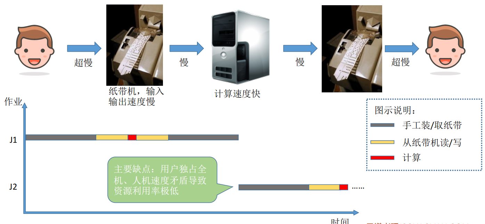
    - 主要缺点：
        1. 用户独占全机
        2. 人机速度矛盾导致资源利用率极低
2. 单道批处理系统：
    - 主要特点：引入了脱机输入/输出技术。并由监督系统负责控制作业的输入输出。
    - 脱机输入、输出技术：
        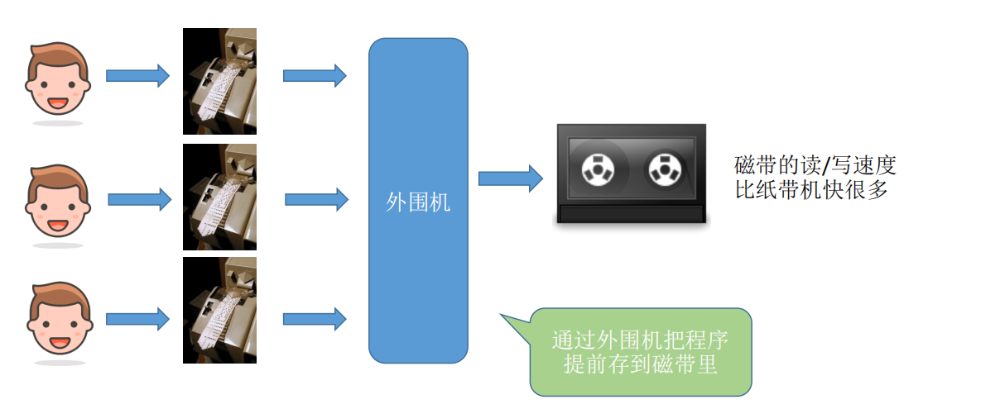
    - 监督系统：
        
    - 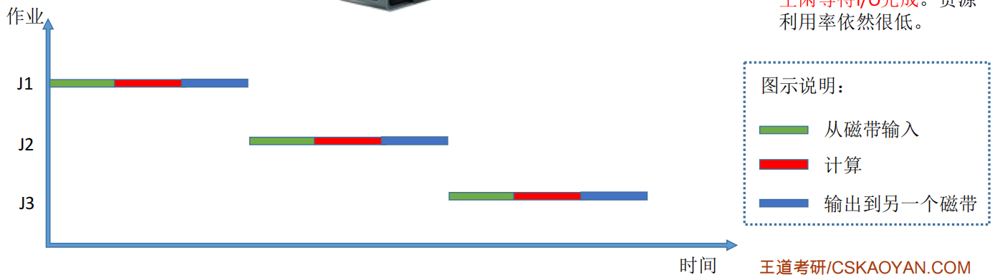
    - 主要优点：缓解了一定程度的人机速度矛盾，资源利用率有所提升
    - 主要缺点：
        1. 内存中仅有一道程序运行
        2. CPU有大量的时间是在空闲等待IO完成，资源利用率仍然很低。
3. 多道批处理系统：
    - 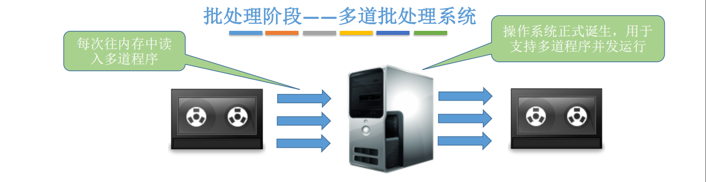
    - 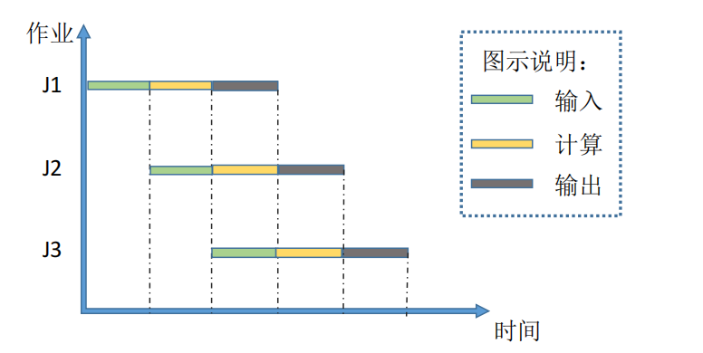
    - 主要优点：`多道程序并发执行，共享计算机资源。资源利用率大幅提升，CPU和其他资源更能保持“忙碌”状态，系统吞吐量增大`
    - 主要缺点：`用户响应时间长，没有人机交互功能。`（用户提交自己的作业之后就只能等待计算机处理完成，中间不能控制自己的作业执行。eg：`无法调试程序/无法在程序运行过程中输入一些参数`）

    引入多道程序设计后，程序的执行就失去了封闭性和顺序性。程序执行因为共享资源及相互协同的原因产生了竞争，相互制约。考虑到竞争的公平性，程序的执行是断续的顺序性是单道程序设计的基本特征。
4. 分时操作系统：
    - 主要特点：计算机`以时间片为单位轮流为各个用户/作业服务`，各个用户`可通过终端与计算机进行交互`。
    - 主要优点：用户请求可以被即时响应，解决了人机交互问题。允许多个用户同时使用一台计算机，并且用户对计算机的操作相互独立，感受不到别人的存在。
    - 主要缺点：不能优先处理一些紧急任务。操作系统对各个用户/作业都是完全公平的，循环地为每个用户/作业服务一个时间片，不区分任务的紧急性。

5. 实时操作系统：
    - 主要特点：在实时操作系统的控制下，计算机系统接收到外部信号后及时进行处理，并且要在严格的时限内处理完事件。实时操作系统的主要特点是及时性和可靠性
    - 主要优点：能够优先响应一些紧急任务，某些紧急任务不需时间片排队
    - 分类：
        - 硬实时系统：必须在绝对严格的规定时间内完成处理，例如：自动驾驶系统
        - 软实时系统：能接受偶尔违反时间规定，例如12306订票系统。
6. 其他几种操作系统：
    - 网络操作系统：是伴随着计算机网络的发展而诞生的，能把网络中各个计算机有机地结合起来，实现数据传送等功能，实现网络中各种资源的共享（如文件共享）和各台计算机之间的通信。
    - 分布式操作系统：主要特点是分布性和并行性。系统中的各台计算机地位相同，任何工作都可以分布在这些计算机上，由它们并行、协同完成这个任务。
    - 个人计算机操作系统：如 Windows XP、MacOS，方便个人使用。

## 1.4 操作系统的运行机制

### 1.4.1 特权指令 vs 非特权指令

应用程序只能使用非特权指令。

操作系统内核作为“管理者”，有时会让CPU执行一些特权指令。

在CPU设计和生产的时候就划分了特权指令和非特权指令，因此CPU执行一条指令前就能判断其类型。

### 1.4.2 用户态 vs 内核态

处于用户态：说明此时正在运行的是应用程序，此时只能执行非特权指令。用户态又称目态。

处于内核态：说明此时正在运行的是内核程序，此时可以执行特权指令。内核态又称核心态、管态。

CPU中的程序状态字寄存器（PSW）用于管理CPU处于用户态还是内核态。

用户态与内核态的转换：
- 用户态->内核态：由`“中断”`引发，硬件自动完成状态修改的过程，触发中断信号意味着操作系统将强行夺回CPU的使用权。`中断是让操作系统内核夺回CPU使用权的唯一途径`。
- 内核态->用户态：执行一条特权指令——修改PSW的标志位为“用户态”，这个动作意味着操作系统将主动让出CPU使用权。

如果没有“中断”机制，那么一旦应用程序上CPU运行，CPU就会一直运行这个应用程序。

## 1.5 中断

中断的类型：
1. 内中断（异常）：与当前执行的指令有关，中断信号来源于CPU内部
    - 陷阱、陷入（trap）：`由陷入指令引发，是应用程序故意引发的`
    - 故障（fault）：`由错误条件引起的，可能被内核程序修复。内核程序修复故障后会把CPU使用权还给应用程序，让它继续执行下去。`例如：`缺页故障`
    - 终止（absort）：`由致命错误引起的，内核程序无法修复该错误，因此一般不再将CPU使用权还给引发终止的应用程序，而是直接终止该应用程序，`例如：`整数除0，非法使用特权指令。`
2. 外中断（中断）：与当前执行的指令无关，中断信号来源于CPU外部
    - 时钟中断
    - I/O中断请求

中断机制的基本实现原理：

1. 检查中断信号
    - 内中断：CPU在执行指令时会检查是否有异常发生
    - 外中断：每个指令周期末尾，CPU都会检查是否有外中断信号需要处理
2. 找到相应的中断处理程序：通过`中断向量表`实现。

## 1.6 系统调用

系统调用的作用：操作系统中的资源需要进行共享，为保证在共享过程中资源的安全性和稳定性，将资源统一交由操作系统内核进行管理，并向上提供系统调用。

应用程序通过`系统调用`请求操作系统的服务。而系统中的各种共享资源都由操作系统内核统一掌管，因此`凡是与共享资源有关的操作（如存储分配、I/O操作、文件管理等），都必须通过系统调用的方式向操作系统内核提出服务请求`，由操作系统内核代为完成。这样可以`保证系统的稳定性和安全性`，`防止用户进行非法操作`。

系统调用一般包括：

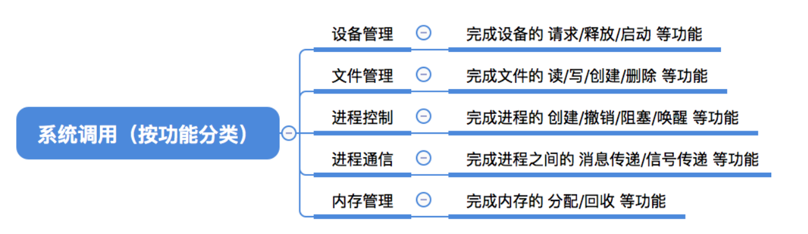

### 1.6.1 库函数与系统调用的区别

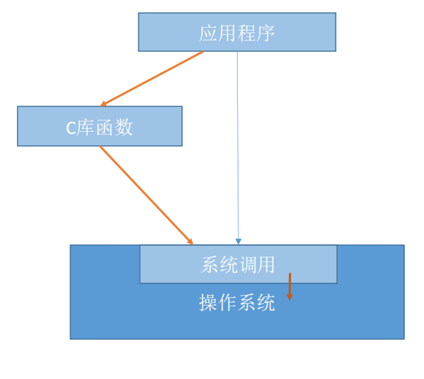

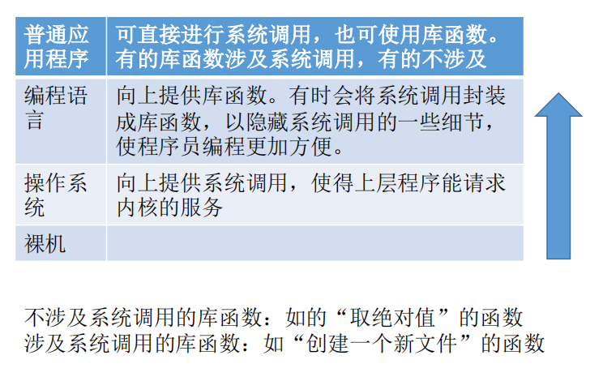

### 1.6.2 系统调用的过程

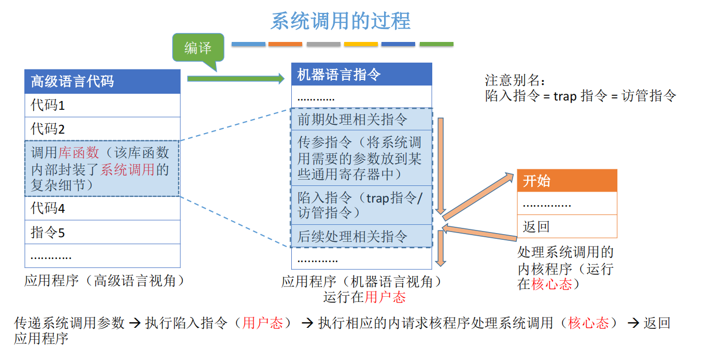

注意：
1. 陷入命令，又称trap指令、访管指令
2. `陷入指令`是在`用户态`执行的，执行陷入指令之后立即引发一个内中断，使CPU进入核心态
3. `发出系统调用请求`是在`用户态`，而对`系统调用的相应处理在核心态下进行`

## 1.7 操作系统的结构体系

### 1.7.1 操作系统的内核以及其实现的功能：

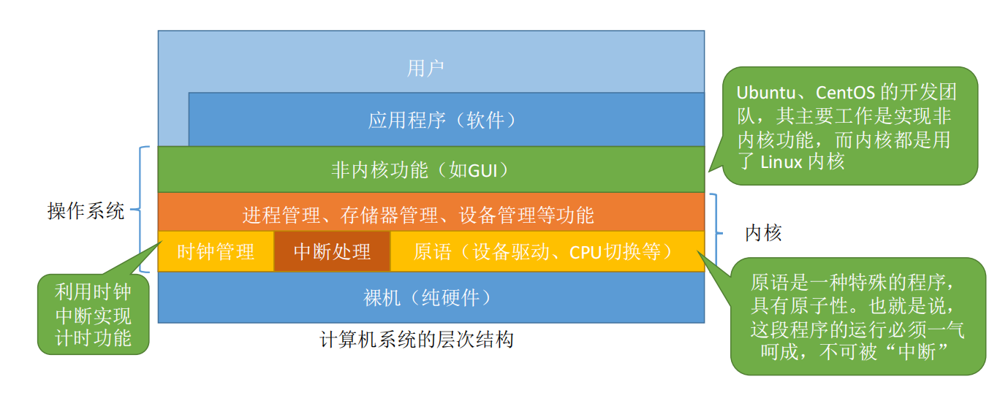

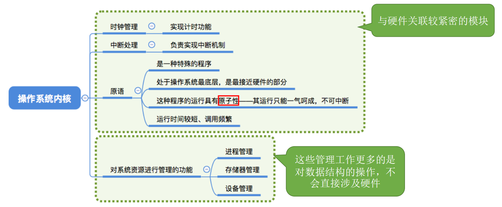

### 1.7.2 宏内核 vs 微内核

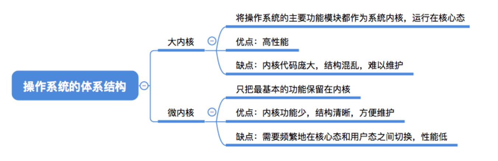

下图进行解释：

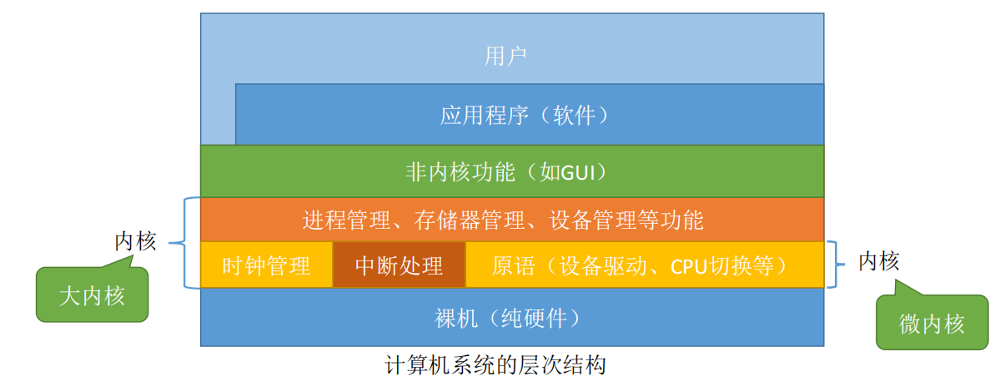

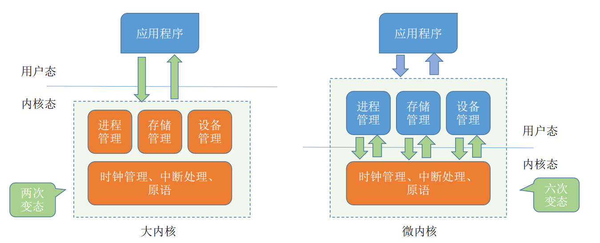

注意：`操作系统内核`需要运行在`内核态`，`操作系统的非内核功能`运行在`用户态`。

微内核架构下，使用进程管理、存储管理
设备管理功能时，会频繁在用户态和内核态之间进行切换。而这种切换代价很大，因此微内核架构相对来说效率更低。

常见的例子：
1. 宏内核：Windows NT
2. 微内核：Linux、Unix
