# 2. 进程管理基础知识

## 2.1 进程的概念、组成及其特征

### 2.1.1 进程的概念

`程序`：存放在磁盘中的可执行文件

`进程`：程序的一次执行过程。

`程序 vs 进程`：程序是静态的，进程是动态的。同一程序多次执行会产生多个进程。

### 2.1.1 进程的组成

进程(进程实体,进程映像)由以下三部分组成：
1. 程序段：程序的代码（指令序列）
2. 数据段：运行过程中的产生的各种数据（如：程序中定义的变量）
3. PCB（Process Control Block）：进程控制块
    1. 进程描述信息：进程标识符PID、用户标识符UID
    2. 进程控制和管理信息
        - CPU/磁盘/网络流量使用情况统计...
        - 进程当前状态:就绪态/阻塞态/运行态... 
    3. 资源分配清单
        - 文件
        - 内存区域
        - IO设备
    4. 处理机相关信息
        - 寄存器

`注意`:
1. `PCB`是给`操作系统`用的.`程序段\数据段`是`给进程自己用的`.
2. `进程`是进程实体的运行过程,是系统进行`资源分配`和`调度`的一个独立单位.
3. PCB是进程存在的唯一标志.
4. 一个进程被调度,就是指操作系统决定让这个进程在CPU上执行

### 2.1.2 进程的特点

1. 动态性(`进程的最基本特征`):进程是程序的一次执行过程,是动态地产生、变化、消亡的
2. 并发性:内存中有多个进程实体，各进程可并发执行
3. 独立性:`进程是能独立运行、独立获得资源、独立接受调度的基本单位`
4. 异步性(导致并发程序执行结果的不稳定性):`各进程按各自独立的、不可预知的速度向前推进，`操作系统要提供“进程同步机制”来解决异步问题
5. 结构性:每个进程都会配置一个PCB。结构上看，进程由程序段、数据段、PCB三部分组成。

## 2.2 进程的执行过程及其状态

### 2.2.1 进程是如何运行的？

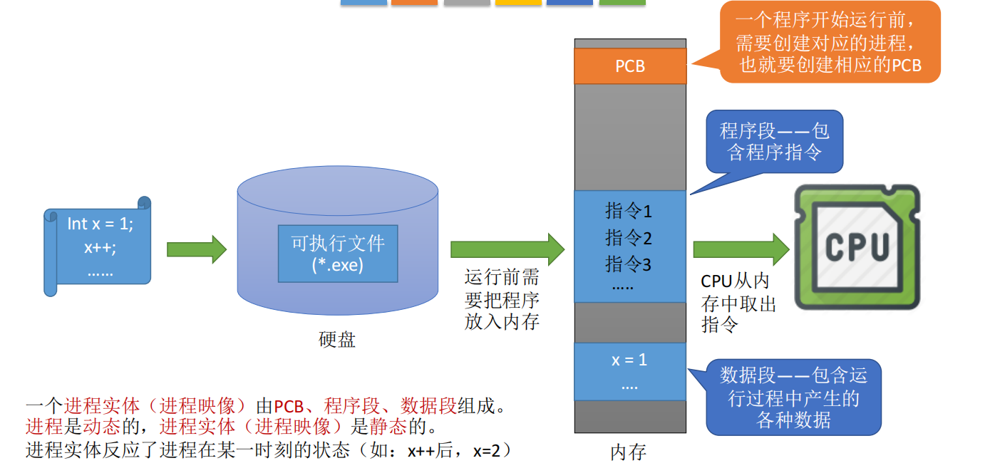

一个程序开始运行前，需要创建进程对应的PCB、数据段、程序段，分配需要的资源。

### 2.2.2 进程的状态

1. 创建态：`进程正在被创建时`，它的状态是`“创建态”`，这个阶段操作系统会为进程`分配资源、初始化PCB`。
2. 就绪态：当进程创建完成之后，便进入`“就绪态”`，`处于就绪态的进程已经具备运行条件，但由于没有空闲CPU，就不能立即运行。`
3. 阻塞态：因等待某一事件而暂时无法运行
4. 运行态：如果一个进程此时在CPU上运行，则这个进程处于`“运行态”`
5. 终止态：进程正在从系统中撤销，操作系统会回收进程拥有的资源，撤销PCB。

其中，`就绪态、阻塞态、运行态`为三种基本状态。

进程状态转换示意图：

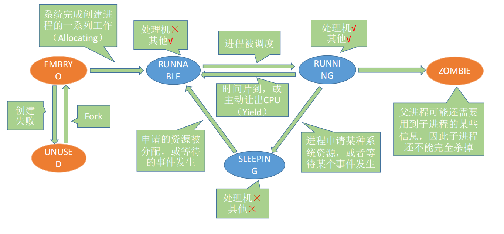

- 创建态->就绪态：系统完成创建进程相关的工作。
- 就绪态->运行态：进程被调度
- 运行态->就绪态：时间片到，或CPU被其他高优先级的进程抢占
- 运行态->阻塞态：等待系统资源分配，或等待某事件发生（主动行为）
- 阻塞态->就绪态：资源分配到位，等待的事件发生（被动行为）
- 运行态->终止态：进程运行结束，或运行过程中遇到不可修复的错误。

### 2.2.3 进程的组织形式

链接方式：按照进程状态将PCB分为多个队列，操作系统持有指向各个队列的指针。

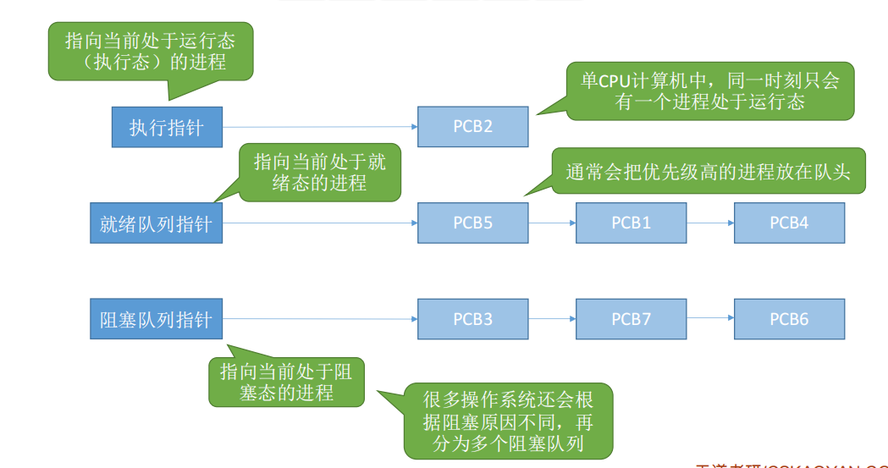

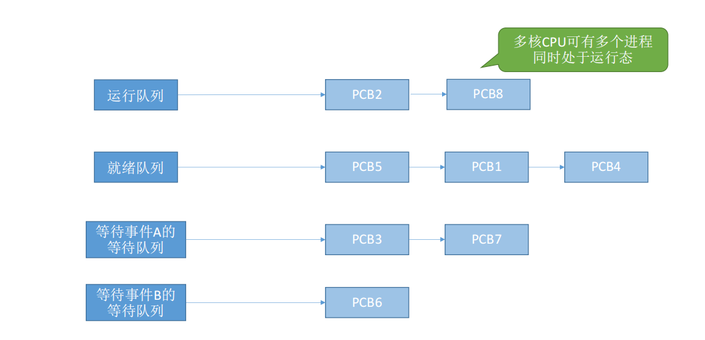

索引方式：根据进程状态的不同，建立几张索引表，操作系统持有指向各个索引表的指针。

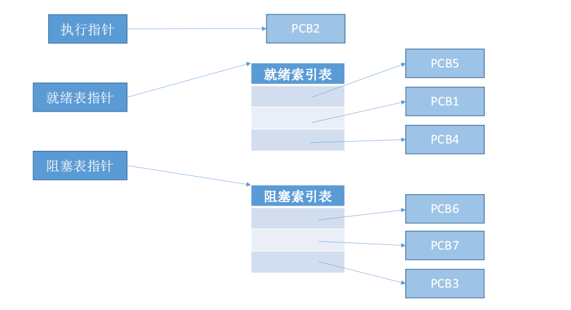

## 2.4 进程控制

`进程控制`的主要功能是`对系统中的所有进程实施有效的管理`，它具有`创建新进程、撤销已有进程、实现进程状态转换`等功能。

`实现进程控制的方式`：用原语实现。原语是一种特殊的程序，它的`执行具有原子性`。也就是说，`这段程序的运行必须一气呵成，不可中断`。

简单解释为何进程控制要使用原语实现：

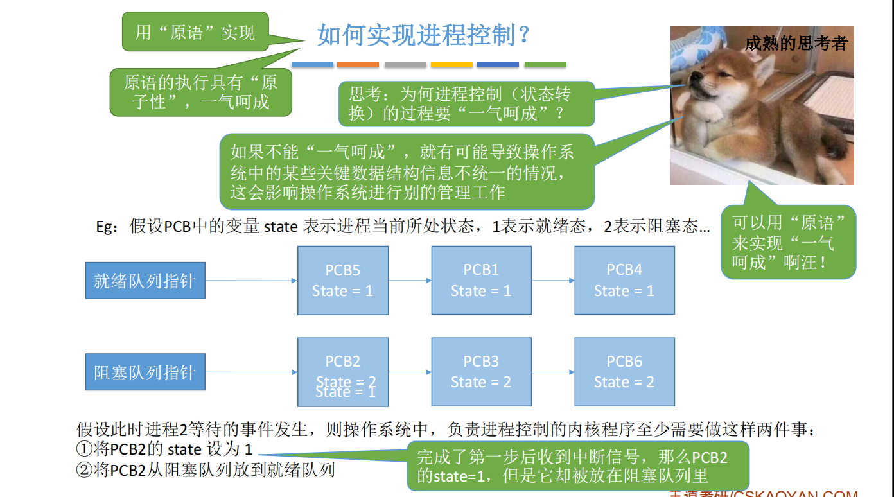

`原语的实现`：原语可以使用`“关中断指令”`和`“开中断指令”`这两个`特权指令`实现原子性。

`注意`：`开关中断，开关的不是中断的产生，而是中断的检测`。正常情况：CPU每执行完一条指令都会例行检查是否有中断信号需要处理，如果有，则暂停运行当前这段程序，转而执行相应的中断处理程序。详见[1.5部分的讲解](../1.Introduction/1.Introduction.md/##1.5)

常见的进程管理原语如下：

1. 进程创建
2. 进程终止
3. 进程阻塞
4. 进程唤醒
5. 进程切换

无论哪个进程控制原语，要做的无非三类事情：
1. 更新PCB中的信息（修改进程状态state，保存/回复运行环境）
2. 将PCB插入合适的队列
3. 分配/回收资源

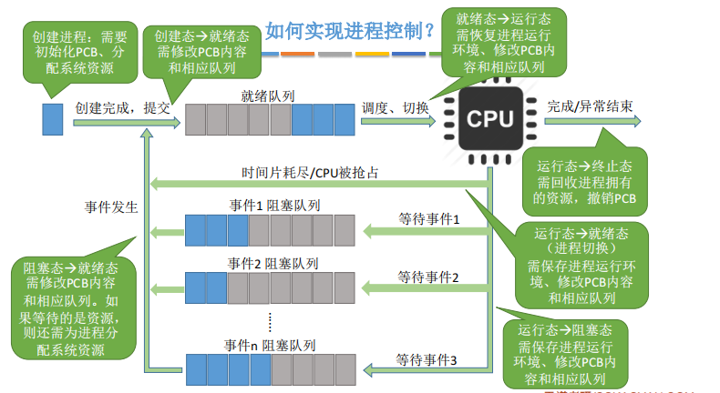

### 2.4.1 进程创建

进程创建原语的执行过程：
1. 创建空白PCB
2. 为新进程分配所需资源
3. 初始化PCB
4. 将PCB插入到就绪队列----->创建态转化为就绪态

引起进程创建的事件：
1. 用户登录：分时系统中，用户登陆成功，系统会为其建立一个新的进程
2. 作业调度：多道批处理系统中，有新的作业放入内存时，会为其建立一个新的进程
3. 提供服务：用户向操作系统提出某些请求时，会建立一个新进程处理该请求
4. 应用请求：由用户进程主动请求创建一个子进程

### 2.4.2 进程终止

进程撤消原语的执行过程：
1. 从PCB集合中找到终止进程的PCB
2. 若进程正在运行，立即剥夺CPU，将CPU分配给其他进程
3. 终止其所有子进程
4. 将该进程拥有的所有资源归还给父进程或操作系统
5. 删除PCB

引起进程终止的事件：
1. 正常结束：进程自己请求终止（exit系统调用）
2. 异常结束：整数除以0，非法使用特权指令，然后被操作系统强行杀死
3. 外界干预：用户选择杀掉进程

### 2.4.3 进程的阻塞和唤醒

进程阻塞原语的执行过程：
1. 找到要阻塞的进程对应的PCB
2. 保护进程运行现场，将PCB状态信息设置为“阻塞态”，暂时停止进程运行
3. 将PCB插入相应事件的等待队列

引进进程阻塞的事件：
1. 需要等待系统分配某种资源
2. 需要等待相互协作的其他进程完成工作

进程唤醒原语的执行过程：
1. 在事件等待队列中找到PCB
2. 将PCB从等待队列移除，设置进程为就绪态
3. 将PCB插入就绪队列，等待被调度

引进进程唤醒的事件：等待的事件发生（因何事阻塞，就由何事唤醒）

注意：阻塞原语和唤醒原语必须成对使用。

### 2.4.4 进程的切换

进程切换原语的执行过程：
1. 将运行环境信息存入PCB
2. 将PCB移入相应队列
3. 选择另一个进程执行，并更新其PCB
4. 根据PCB恢复新进程所需的运行环境

引起进程切换的事件：
1. 当前进程时间片到
2. 有更高优先级的进程到达
3. 当前进程主动阻塞
4. 当前进程终止

## 2.5 进程通信（IPC）

进程间通信（IPC）是指两个进程之间产生数据交互。

进程是分配系统资源的单位（包括内存地址空间），因此各进程拥有的内存地址空间相互独立。

为了保证安全，一个进程不能直接访问另一个进程的地址空间。

进程通信一般包括如下三种实现方式：
1. 共享存储
2. 消息传递
3. 管道通信
4. 共享文件：利用操作系统提供的文件共享功能实现进程之间的通信。这时，也需要信号量来解决文件共享操作中的同步和互斥问题。

### 2.5.1 共享存储

共享存储包括两种方式：

1. 基于数据结构的共享：例如共享空间内只放一个长度为10的数组。这种`共享方式速度慢、限制多`，是一种`低级通信方式`。
2. 基于存储区的共享：操作系统在内存中`划分出一块共享存储区`，`数据的形式、存放位置都由通信进程控制，而不是操作系统`。这种方式速度很快，是一种`高级通信方式`。

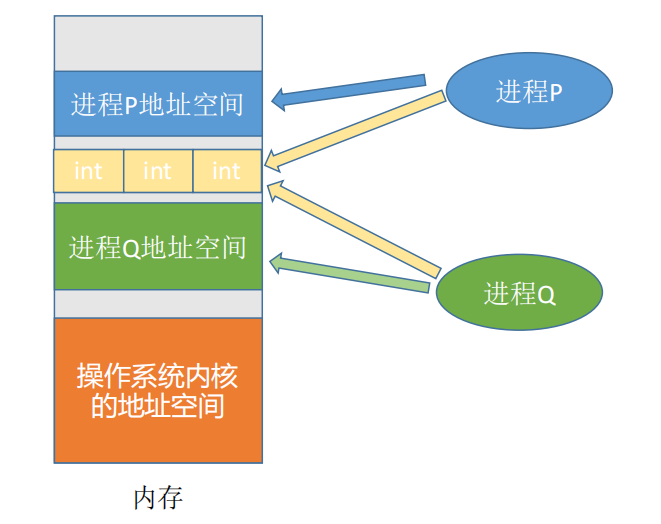

### 2.5.2 消息传递

进程间的数据交换以格式化的消息为单位。进程通过操作系统提供的“发送消息/接收消息”两个原语进行数据交换。


消息传递包括：
1. 直接通信方式：消息发送进程要指明接收进程的ID
2. 间接通信方式：通过“信箱”间接地通信，因此又称“信箱通信方式”。

#### 2.5.2.1 直接通信方式

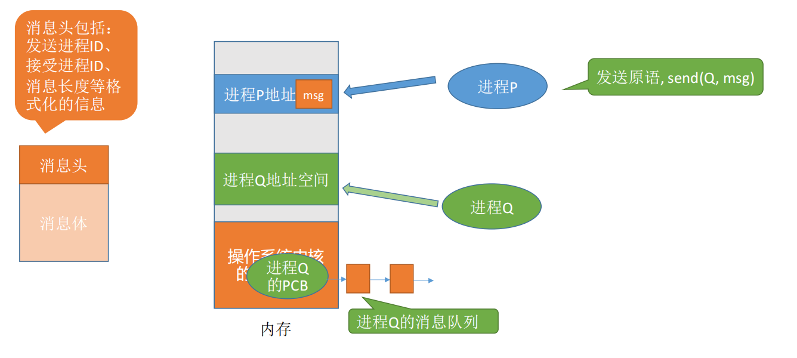

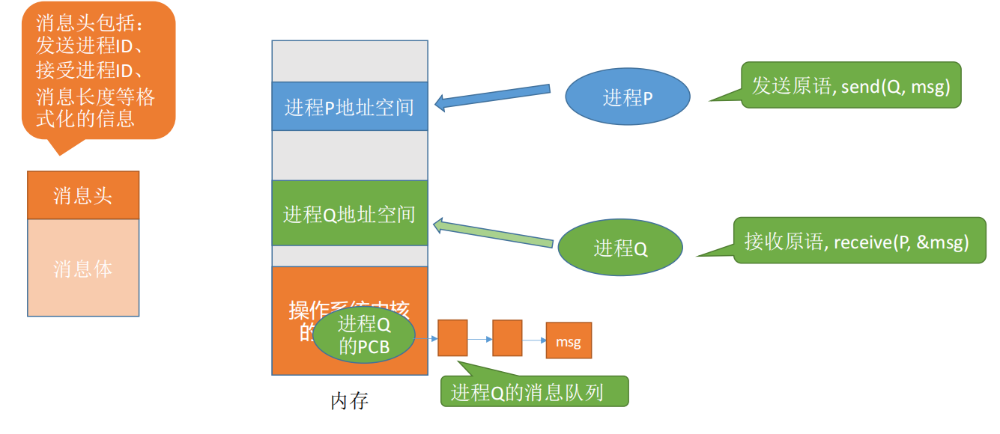

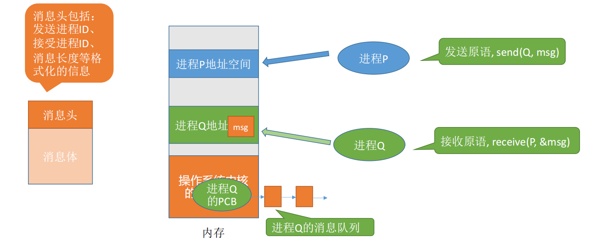

#### 2.5.2.2 间接通信方式

间接通信方式以“信箱”作为中介实体进行消息传递。SOCKET套接字就是这种方式最好的例子。

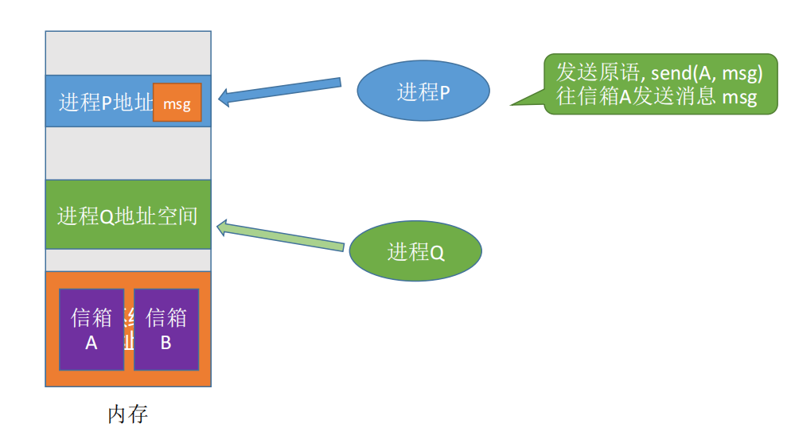

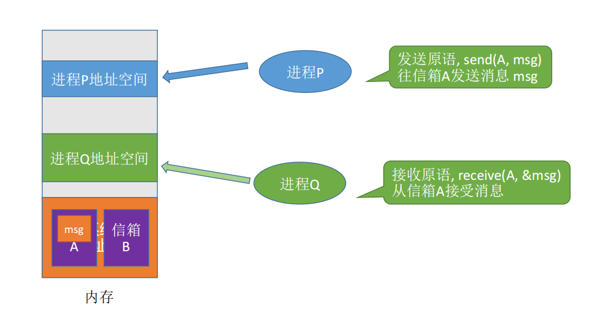

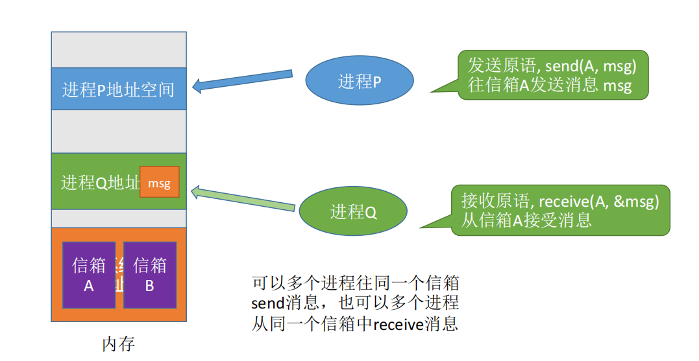

### 2.5.3 管道通信

`“管道”`是一个`特殊的共享文件`，又名`pipe文件`。其实就是`在内存中开辟一个大小固定的内存缓冲区`。

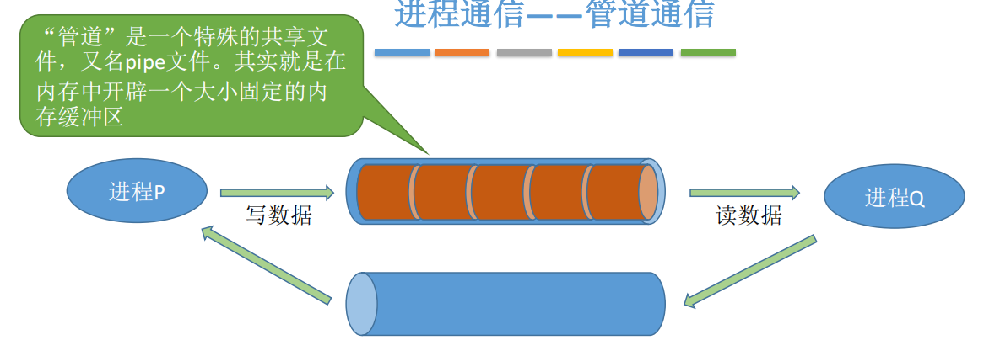

一个最简单使用管道通信的例子：
```shell
ls -1 | wc –l
```

除此之外，也可以使用`pipe(..)`函数创建管道。

注意：
1. 管道只能采用`半双工通信`，`某一时间段内只能实现单向的传输`。如果要实现双向同时通信，则需要设置两个管道。
2. 各进程要互斥地访问管道（由操作系统实现）。
3. 当管道写满时，写进程将阻塞，直到读进程将管道的数据取走，即可唤醒进程。
4. 当管道写空时，读进程将管道阻塞，直到写进程向管道内写入数据，即可唤醒读进程。
5. 管道中的数据`一旦被读出，就彻底消失。因此，当多个进程读同一个管道时，可能会错乱。`对此，通常
有`两种解决方案`：`①一个管道允许多个写进程，一个读进程`（2014年408真题高教社官方答案）；②`允许有多个写进程，多个读进程，但系统会让各个读进程轮流从管道中读数据`（Linux 的方案）。


## 2.6 线程

线程是一个基本的CPU执行单元，也是程序执行流的最小单位。

`引入线程后带来的变化`:
1. 引入线程之后，不仅是进程之间可以并发，进程之间的各个线程也可以并发，从而进一步提升了系统的并发度。
2. `引入线程后，进程只作为除CPU之外的系统资源的分配单元`。`线程是处理机的分配单元`。
3. 传统的进程间的并发，需要切换进程的运行环境，系统开销很大。线程间的并发，如果是同一进程内的线程切换，则不需要切换进程环境，系统开销较小。引入线程后，并发所带来的系统开销变小了。

### 2.6.1 线程的基本属性

1. 线程是处理机调度的单位
2. 多CPU计算机中，各个线程可占用不同的CPU。
3. 每个线程都有一个线程ID、线程控制块（TCB）
4. 线程也有就绪、阻塞、运行三种基本状态。
5. 线程几乎不拥有系统资源
6. 同一进程的不同线程间共享进程的资源
7. 由于共享内存地址空间，统一进程中线程间的通信甚至无需系统干预
8. 同一进程中的线程切换，不会引起进程切换。
9. 不同进程中的线程切换，会引起进程切换。
10. 切换同进程内的线程，系统开销很小。
11. 切换进程，系统开销很大。

### 2.6.2 线程的实现方式

线程的实现方式包括两种：
1. 用户级线程
2. 内核级线程

其中用户级线程是在`早期操作系统不支持线程的条件`下，`由线程库实现`的线程功能。

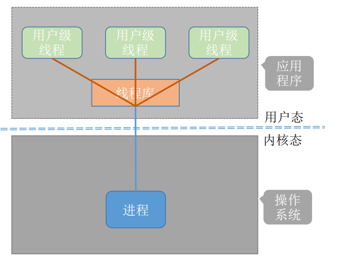

注意:
1. 用户级线程的底层仍然只有一个进程。
2. 线程的管理工作谁来完成？线程管理工作由应用程序来完成（线程库），包括线程切换功能。
3. 线程切换是否需要CPU核心态和用户态的切换？线程切换可以在用户态完成，无需切换到核心态。
4. 操作系统是否能意识到用户级线程的存在？在用户看来，是有多个线程。但是`在操作系统内核看来，并意识不到线程的存在`。“用户级线程”就是“从用户视角看能看到的线程”。
5. 优缺点：
   1. 优点：`用户级线程的切换在用户空间即可完成，不需要切换到核心态`，`线程管理的开销小，效率高`。
   2. 缺点：`当一个用户级线程被阻塞后，整个进程都会被阻塞，并发度不高`。多个线程不可在多核处理机上并行运行。

内核级线程是由操作系统支持的线程。

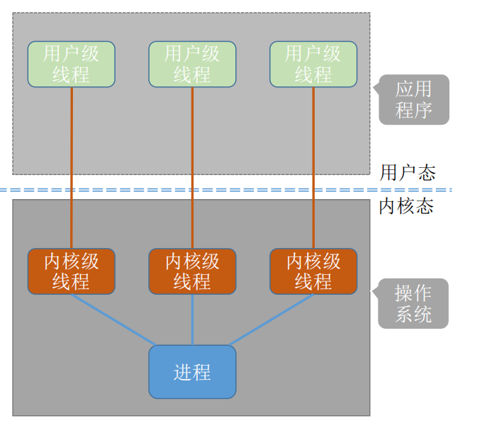

注意:
1. 线程的管理工作谁来完成？`内核级线程的管理工作由操作系统内核完成`。
3. 线程切换是否需要CPU核心态和用户态的切换？线程调度、切换等工作都由内核负责，因此`内核级线程的切换必然需要在核心态下才能完成`。
4. 操作系统是否能意识到用户级线程的存在？`操作系统会为每个内核级线程建立相应的TCB（Thread Control Block，线程控制块），通过TCB对线程进行管理`。`“内核级线程就是“从操作系统内核视角看能看到的线程”`。
5. 优缺点：
   1. 优点：`当一个线程被阻塞后，别的线程还可以继续执行，并发能力强。多线程可在多核处理机上并行执行。`。
   2. 缺点：`一个用户进程会占用多个内核级线程，线程切换由操作系统内核完成，需要切换到核心态，因此线程管理的成本高，开销大`。

### 2.6.3 多线程模型

在`支持内核级线程的系统`中，`根据用户级线程和内核级线程的映射关系`，可以划分为几种多线程模型：
1. 一对一
2. 多对一
3. 多对多

一对一模型：一个用户级线程映射到一个内核级线程。每个用户进程有与用户级线程同数量的内核级线程。

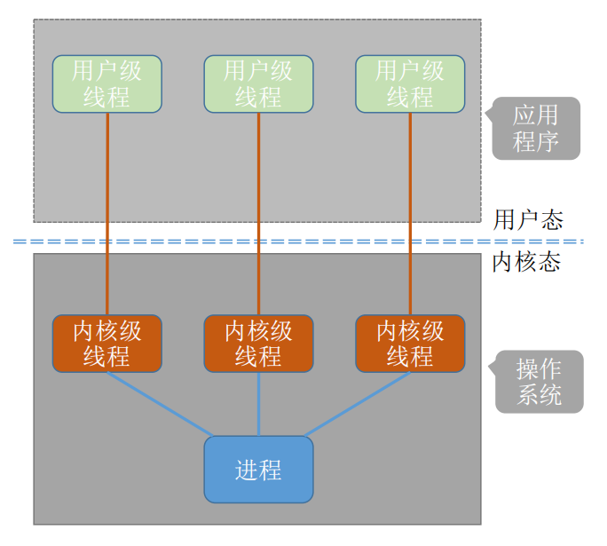

`优点`：当一个线程被阻塞后，别的线程还可以继续执行，并发能力强。多线程可在多核处理机上并行执行。

`缺点`：一个用户进程会占用多个内核级线程，线程切换由操作系统内核完成，需要切换到核心态，因此线程管理的成本高，开销大。

`多对一模型`：多个用户级线程映射到一个内核级线程。且一个进程只被分配一个内核级线程。可以类比用户级线程。

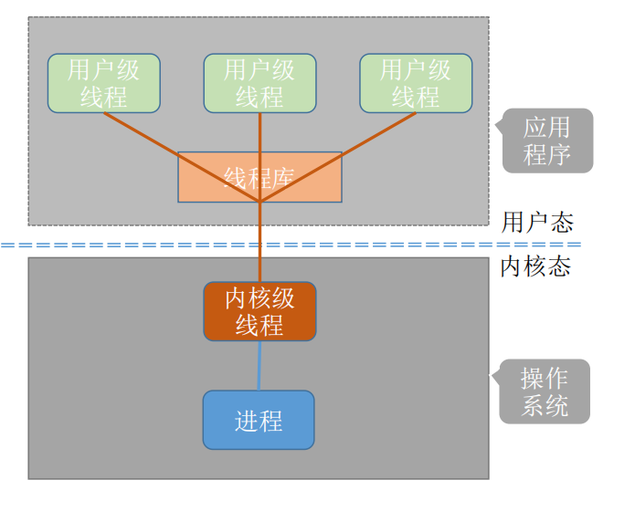

`优点`：`用户级线程的切换在用户空间即可完成，不需要切换到核心态，线程管理的系统开销小，效率高`。

`缺点`：`当一个用户级线程被阻塞后，整个进程都会被阻塞，并发度不高。多个线程不可在多核处理机上并行运行`。

注意：`操作系统只看得到内核级线程，因此只有内核级线程才是处理机分配的单位`。

`多对多模型`：n用户级线程映射到m个内核级线程（n>=m）。每n个用户进程对应m个内核级线程。

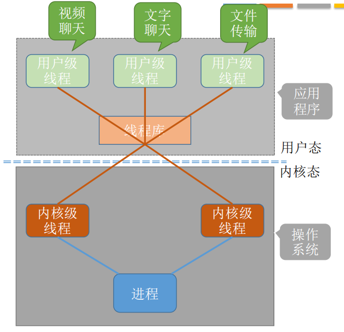

`特点`：`克服了多对一模型并发度不高的缺点（一个阻塞全体阻塞），又克服了一对一模型中一个用户进程占用太多内核级线程，开销太大的缺点`。内核级线程中可以运行任意一个有映射关系的用户级线程代码，`只有两个内核级线程中正在运行的代码逻辑都阻塞时，这个进程才会阻塞`
