# 2-2.进程调度

## 1. 调度的概念及层次

`当有一堆任务要处理，但由于资源有限，这些事情没法同时处理。这就需要确定某种规则来决定处理这些任务的顺序`，这就是`调度`。

调度的三个层级：
1. 高级调度
2. 中级调度
3. 低级调度

### 1.1 高级调度（作业调度）

作业：一个具体的任务（可以理解为是启动一个程序）。

`高级调度（作业调度）`：`按一定的原则从外存的作业后备队列中挑选一个作业调入内存，并创建进程`。`每个作业只调入一次，调出一次`。`作业调入时会建立PCB，调出时才撤销PCB`。

常见情况：内存空间有限，有时无法将用户提交的作业全部放入内存。

`高级调度`：`作业在外存与内存之间的调度`。

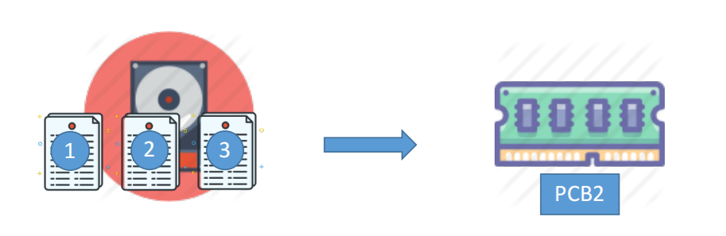

### 1.2 中级调度（内存调度）

内存不够时，可将某些进程的数据调出外存。等内存空间或者进程需要运行时再重新调入。

暂时调到外存等待的进程状态为`挂起状态`。被挂起的进程PCB会被组织成`挂起队列`。

`中级调度（内存调度）`：`按照某种策略决定将哪个处于挂起状态的进程调入内存`。一个进程可能会被多次调度、调入内存，因此`中级调度发生的频率要比高级调度更高`。

### 1.3 低级调度（进程调度/处理机调度）

`低级调度（进程调度/处理机调度）`：`按照某种策略从就绪队列中选取一个进程，将处理机分配给它`。

`进程调度是操作系统中最基本的一种调度`。在一般的操作系统中都必须配置进程调度。进程调度的频率很高，一般几十毫秒一次。

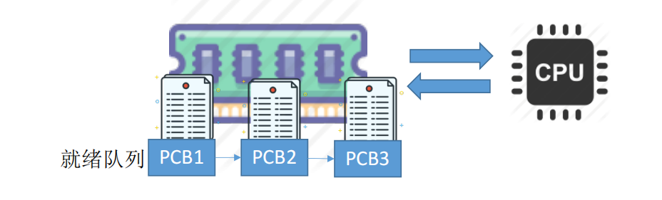

### 1.4 三种调度对比

| 名称                 | 要做什么                                                             | 调度发生在...          | 发生频率 | 对进程状态的影响                   |
| -------------------- | -------------------------------------------------------------------- | ---------------------- | -------- | ---------------------------------- |
| 高级调度（作业调度） | 按照某种规则，从后备队列中选择合适的作业将其调入内存，并为其创建进程 | 外存->内存（面向作业） | 最低     | 无->创建态->就绪态                 |
| 中级调度（内存调度） | 按照某种规则，从挂起队列中选择何事的进程将其数据调回内存             | 外存->内存（面向进程） | 中等     | 挂起态->就绪态（阻塞挂起->阻塞态） |
| 低级调度（进程调度） | 按照某种规则，从就绪队列中选择一个进程为其分配处理机                 | 内存->CPU              | 最高     | 就绪态->运行态                     |

### 1.5 七状态模型

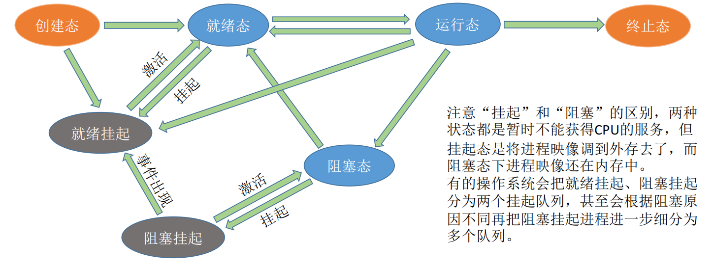

暂时调到外存等待的进程状态为`挂起状态`。`挂起态`又可以进一步细分为`就绪挂起`、`阻塞挂起`两种状态。

- 就绪态->就绪挂起态：内存不够
- 阻塞态->阻塞挂起态：内存不够
- 就绪挂起态->就绪态：内存够了
- 阻塞挂起态->阻塞态：内存够了
- 阻塞挂起态->就绪挂起态：等待事件出现

注意：
1. 挂起vs阻塞：
   1. 共同点：都暂时不能获取到CPU的服务
   2. 区别：挂起态将进程映像调到外存去了。阻塞态下进程的映像在内存。

## 2. 进程调度的时机

1. `需要进行进程调度与切换的情况`：
   1. `当前运行的进程主动放弃处理机`：
      1. 进程正常终止
      2. 运行过程中发生异常而终止
      3. 进程主动请求阻塞（如等待I/O）
    2. `当前运行的进程被动放弃处理机`：
       1. 分给进程的时间片用完
       2. 有更紧急的事情需要处理（如I/O中断）
       3. 有更高优先级的进程进入就绪队列
2. `不能进行进程调度与切换的情况`：
   1. `在处理中断的过程中`。`中断处理过程复杂，与硬件密切相关，很难做到在中断处理过程中进程切换`。
   2. 进程在`操作系统内核程序临界区`中。
   3. `在原子操作过程中（原语）`。原子操作不可中断，要一气呵成。

临界资源：一个时间段内只允许一个进程使用的资源。各进程需要互斥地访问临界资源。

临界区：访问临界资源的那段代码

注意：
1. 进程处于临界区时可以进行处理机调度
2. 进程在操作系统内核程序临界区中不能进行调度与切换。内核程序临界区一般是用来访问某种内核数据结构的。

## 3. 进程调度的方式

1. `非剥夺调度方式`：`非抢占方式`。只允许进程主动放弃处理机。在运行过程中即便有更紧迫的任务到达，当前进程依然会继续使用处理机，直到该进程终止或主动要求进入阻塞态。
    - 特点：`实现简单，系统开销小`但是`无法及时处理紧急任务`，适合于早期的批处理系统
2. `剥夺调度方式`：又称`抢占方式`。当一个进程正在处理机上执行时，如果有一个更重要或更紧迫的进程需要使用处理机，则立即暂停正在执行的进程，将处理机分配给更重要紧迫的那个进程。
    - 特点：`可以优先处理更紧急的进程，也可实现让各进程按时间片轮流执行的功能`（通过时钟中断）。适合于分时操作系统、实时操作系统

注意：
1. 狭义的进程调度 vs 进程切换 vs 广义的进程调度
   - 狭义的进程调度：`从就绪队列中选中一个要运行的进程`。
   - 进程切换：`让一个进程让出处理机，由另一进程占用处理机的过程`。
   - 广义的进程调度：`包含了选择一个进程和进程切换两个步骤`。
2. 进程切换主要完成了：
   1. 对原来运行进程各种数据的保存。
   2. 对新的进程各种数据的恢复。`进程切换是有代价的`，因此如果`过于频繁的进行进程调度、切换`，`必然会使整个系统的效率降低`，使系统大部分时间都花在了进程切换上，而真正用于执行进程的时间减少

## 4. 调度算法的评价指标

调度算法的评价指标包括：
1. CPU利用率
2. 系统吞吐量
3. 周转时间
   1. 周转时间、平均周转时间
   2. 带权周转时间、平均带权周转时间
4. 等待时间
5. 响应时间

### 4.1 CPU利用率

`CPU利用率`是指`CPU忙碌的时间占总时间的比例`。

通常会考察多道程序并发执行的情况，可以用甘特图来辅助计算。

### 4.2 系统吞吐量

`系统吞吐量`：单位时间内完成作业的数量。

`系统吞吐量 = 总共完成了多少道作业 / 总共花了多少时间`

### 4.3 周转时间

周转时间是指从作业被提交给系统开始，到作业完成为止这段时间间隔。

包括4个部分：
1. 作业在外存后备队列上等待作业调度（高级调度）的时间
2. 进程在就绪队列上等待进程调度（低级调度）的时间
3. 进程在CPU上执行的时间
4. 进程等待I/O操作完成的时间

`周转时间 = 作业完成时间 - 作业提交时间`

`平均周转时间 = 各作业周转时间之和 / 作业数`

`带权周转时间 = 作业周转时间 / 作业实际的运行时间 = （作业完成时间 - 作业提交时间） / 作业实际的运行时间`

`平均带权周转时间 = 各作业带权周转时间之和 / 作业数`

注意：
1. 带权周转时间必然>=1。
2. 带权周转时间和周转时间都是越小越好。

### 4.4 等待时间

等待时间，是指进程/作业处于等待处理机状态时间之和，等待时间越长，用户的满意度越低。

对于`进程`来说，等待时间是指`进程建立后等待被服务的时间之和`。在`等待I/O完成的期间其实进程也是在被服务的，所以不计入等待时间`。

对于`作业`来说，不仅要考虑`建立进程后的等待时间`，还要加上`作业在外存后备队列中等待的时间`。

### 4.5 响应时间

响应时间：用户提交请求到首次产生响应所用的时间。

## 5. 调度算法

学习各调度算法的思路：
1. 算法思想
2. 算法规则
3. 这种调度算法是用于作业调度还是进程调度？
4. 是抢占式还是非抢占式？
5. 优点和缺点
6. 是否会导致饥饿？

本部分主要介绍的调度算法包括：
1. 先来先服务（FCFS）
2. 短作业优先（SJF）
3. 高响应比优先（HRRN）
4. 时间片轮转调度算法（RR）
5. 优先级调度算法
6. 多级反馈队列调度算法

### 5.1 先来先服务（FCFS）

- 算法思想：主要从公平的角度考虑
- 算法规则：按照作业/进程到达的先后顺序进行服务
- 用于作业/进程调度：用于作业调度时，考虑的是哪个作业先到达后备队列；用于进程调度时，考虑的是哪个进程先到达就绪队列。
- 是否可抢占？非抢占的算法
- 优缺点：
  - 优点：公平、算法实现简单
  - 缺点：排在长作业（进程）后面的短作业（进程）需要等待很长时间，带权周转时间很大，对短作业来说用户体验不好。
  - `FCFS算法对长作业有利，对短作业不利`。
- 是否会饥饿：`不会`

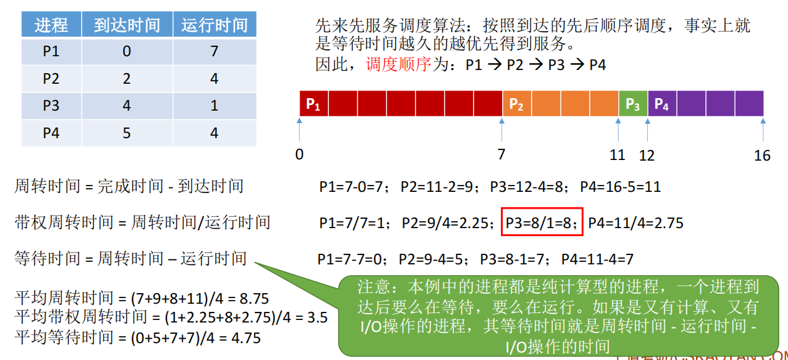

### 5.2 短作业优先（SJF）

- 算法思想：追求最少的平均等待时间，最少的平均周转时间、最少的平均带权周转时间。
- 算法规则：最短的作业/进程优先得到服务（所谓最短，是指要求服务时间最短）
- 用于作业/进程调度：即可用于作业调度，也可用于进程调度。用于进程调度时称为“短进程优先（SPF）算法”
- 是否可抢占？：SPF/SJF是`非抢占式`的算法，但是也有`抢占式的版本——最短剩余时间优先的算法（SRTN）`。
- 优缺点：
  - 优点：`“最短的”平均等待时间、平均周转时间`
  - 缺点：`不公平`。`对短作业有利，对长作业不利`。`可能产生饥饿现象`。另外，作业/进程的运行时间是由用户提供的，并不一定真实，不一定能做到真正的短作业优先。
- 是否会导致饥饿？会。`如果源源不断地有短作业/进程到来，可能使长作业/进程长时间得不到服务，产生“饥饿”的现象`。如果一直得不到服务，则称为`“饿死”`。

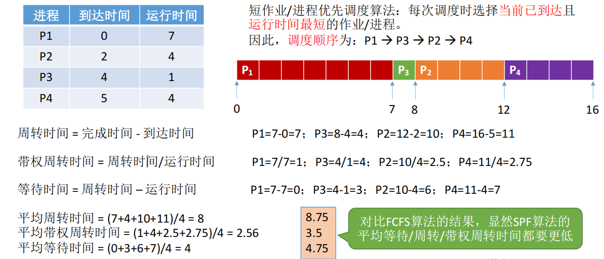

`最短剩余时间优先（SRTN）算法`：`每当有进程加入就绪队列改变时就需要调度`，如果新到达的进程剩余时间比当前运行的进程剩余时间更短，则由新进程抢占处理机，当前运行进程重新回到就绪队列。另外，`当一个进程完成时也需要调度`。

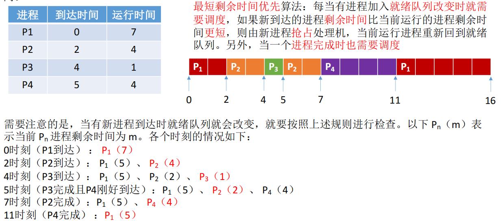

注意：
1. “短作业/进程优先算法”默认`是非抢占的`。
2. `在所有进程同时可运行时，采用SJF调度算法的平均等待时间、平均周转时间最少”`=`“在所有进程都几乎同时到达时，采用SJF调度算法的平均等待时间、平均周转时间最少”`
3. `抢占式的短作业/进程优先调度算法（最短剩余时间优先, SRNT算法）`的平均等待时间、平均周转时间最少

### 5.3 高响应比优先

- 算法思想：要综合考虑作业/进程的等待时间和要求服务的时间
- 算法规则：在每次调度时先计算每个作业/进程的响应比，选择响应比最高的作业/进程为其服务。`响应比=（等待时间+要求服务时间）/要求服务时间`
- 用于作业/进程调度：即可用于作业调度，也可用于进程调度
- 是否可抢占？非抢占式算法。因此只有当前运行的作业/进程主动放弃处理机时，才需要调度，才需要计算响应比。
- 优缺点：
  - 综合考虑了等待时间和运行时间（要求服务时间）
  - 等待时间相同时，要求服务时间短的优先（SJF的优点）
  - 要求服务时间相同时，等待时间长的优先（FCFS的优点）
  - 对于长作业来说，随着等待时间越来越久，其响应比也会越来越大，从而避免了长时间饥饿的问题。
- 是否会饥饿？不会

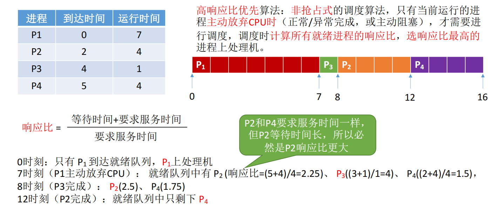

| 算法    | 思想&规则 | 可抢占？                                                        | 优点                                                 | 缺点                                                 | 考虑到等待时间&运行时间？ | 会导致饥饿？ |
| ------- | --------- | --------------------------------------------------------------- | ---------------------------------------------------- | ---------------------------------------------------- | ------------------------- | ------------ |
| FCFS    |           | 非抢占式                                                        | 公平：实现简单                                       | 对短作业不利                                         | 等待时间√运行时间×        | 不会         |
| SJF/SPF |           | 默认为非抢占式，也有SJF的抢占式版本最短剩余时间优先算法（SRTN） | “最短的”平均等待/周转时间                            | 对长作业不利，可能导致饥饿；难以做到真正的短作业优先 | 等待时间×运行时间√        | 会           |
| HRRN    |           | 非抢占式                                                        | 上述两种算法的权衡折中，综合考虑的等待时间和运行时间 |                                                      | 等待时间√运行时间√        | 不会         |

注：这几种算法主要关心对用户的公平性、平均周转时间、平均等待时间等评价系统整体性能的指标，但是不关心`“响应时间”`，也并不区分任务的紧急程度，因此对于用户来说，`交互性很糟糕`。因此这三种算法一般适合用于`早期的批处理系统`，当然，FCFS算法也常结合其他的算法使用，在现在也扮演着很重要的角色。

### 5.4 时间片轮转（RR）

- 算法思想：公平地、轮流地为各个进程服务，让每个进程在一定时间间隔内都可以得到响应。
- 算法规则：按照各进程到达就绪队列的顺序，轮流让各个进程执行一个`时间片`。若进程未在一个时间片内执行完，则剥夺处理机，将进程重新放到就绪队列队尾重新排队。
- 用于作业/进程调度：用于进程调度（只有作业放入内存建立了相应的进程后）
- 是否可抢占？若进程未能在时间片内运行完，将被强行剥夺处理机使用权，因此时间片轮转调度算法属于`抢占式`的算法。由时钟装置发出的`时钟中断`来通知CPU时间片已到。
- 优缺点：
  - 优点：公平；响应快，适用于分时操作系统
  - 缺点：由于高频率的进程切换，因此有一定开销；不区分任务的紧急程度。
- 是否会饥饿？不会

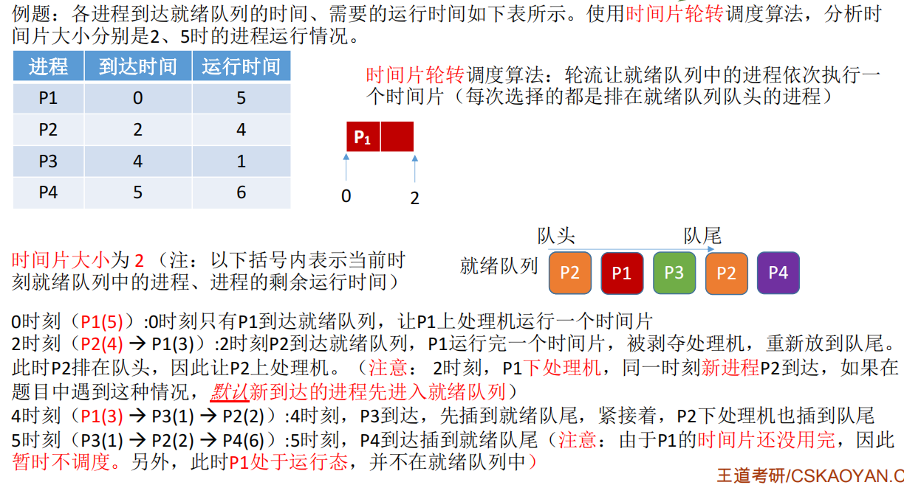

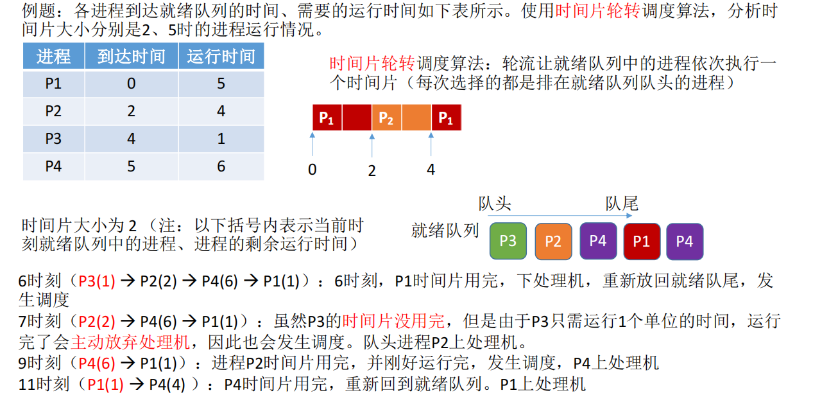

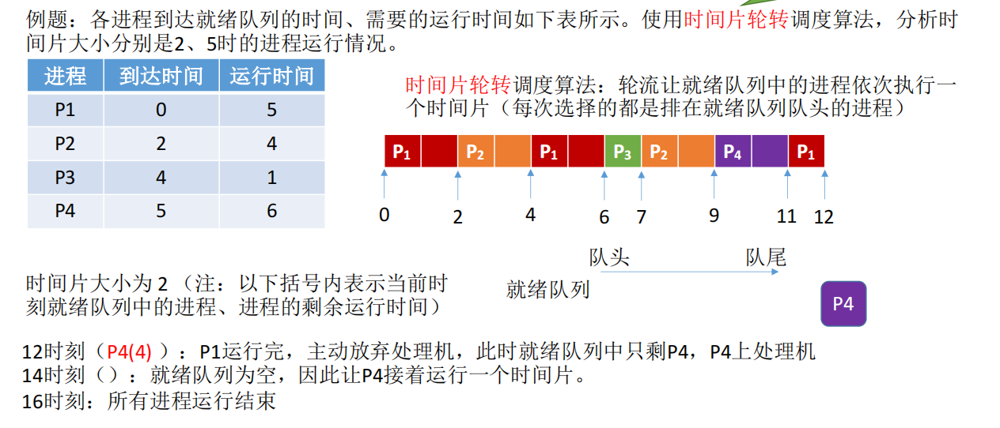

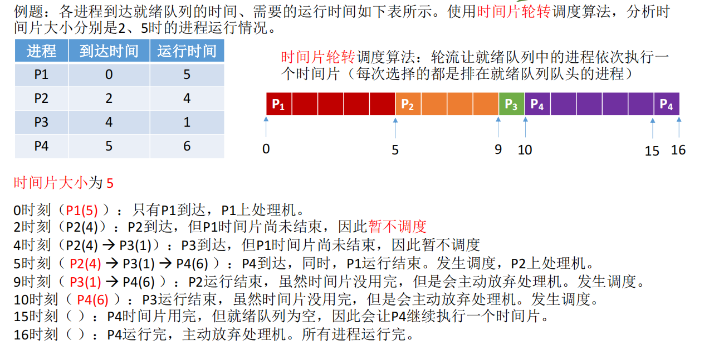

注意：
1. 如果时间片太大，使得每个进程都可以在一个时间片内就完成，则时间片轮转调度算法退化为先来先服务调度算法，并且会增大进程响应时间。因此时间片不能太大。
2. 进程调度、切换是有时间代价的（保存、恢复运行环境），因此如果时间片太小，会导致进程切换过于频繁，系统会花大量时间来处理进程切换，从而导致实际用于进程执行的时间所占比例减少。可见时间片也不能太小。

### 5.5 优先级调度算法

- 算法思想：随着计算机的发展，特别是实时操作系统的出现，越来越多的应用场景需要根据任务的紧急程度来决定处理顺序。
- 算法规律：每个作业/进程有各自的优先级，调度时选择优先级最高的作业/进程
- 用于作业/进程调度：既可用于作业调度，也可用于进程调度。甚至还会用于I/O调度。
- 是否可抢占？抢占式、非抢占式都有。区别在于：非抢占式只
需在进程主动放弃处理机时进行调度即可，而抢占式还需在就绪队列变化时，检查是否会发生抢占。
- 优缺点：
  - 优点：用优先级区分紧急程度、重要程度，适用于实时操作系统。可灵活地调整对各种作业/进程的偏好程度。
  - 缺点：若源源不断地有高优先级进程到来，则会导致饥饿。
- 是否会导致饥饿：会

非抢占式的优先级调度算法：

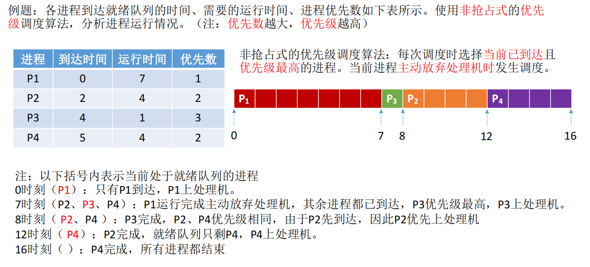

抢占式优先级调度算法：

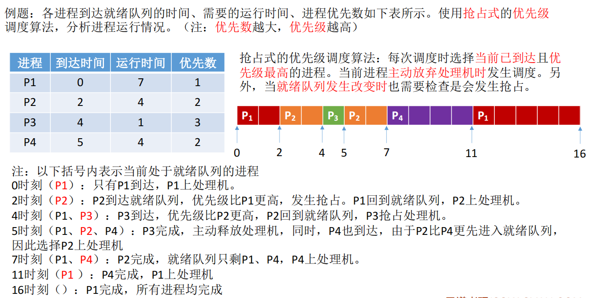

注意：
1. 就绪队列未必只有一个，可以按照不同优先级来组织。另外，也可以把优先级高的进程排在更靠近队头的位置。
2. 根据优先级是否可以动态改变，可将优先级分为静态优先级和动态优先级两种。
   1. 静态优先级：创建进程时确定，之后就一直不变
   2. 动态优先级：创建进程时有一个初始值，之后会根据情况动态调整优先级。
3. 系统进程优先级高于用户进程；前台进程优先级高于后台进程。操作系统更偏好I/O型进程（或称I/O繁忙型进程）。与I/O型进程相对的是计算型进程（或称CPU繁忙型进程）。
4. 可以从追求公平、提升资源利用率等角度考虑
   - 如果某进程在就绪队列中等待了很长时间，则可以适当提升其优先级
   - 如果某进程占用处理机运行了很长时间，则可适当降低其优先级
   - 如果发现一个进程频繁地进行I/O操作，则可适当提升其优先级

### 5.6 多级反馈调度算法

- 算法思想：对其他调度算法的折中权衡。
- 算法规则：
   1. 设置多级就绪队列，各级队列优先级从高到低，时间片从小到大。
   2. 新进程到达时先进入第一级队列，按FCFS原则排队等待被分配时间片，若用完时间片进程还未结束，则进程进入下一级队列队尾。如果此时已经是在最下级的队列，则重新放回该队列队尾。
   3. 只有第k级队列为空时，才会为k+1级队头的进程分配时间片。
- 用于作业/进程调度：用于进程调度
- 是否可抢占？：抢占式的算法。在k级队列的进程进行过程中，若更上级的队列（1~k-1级）中进入了一个新进程，则由于新进程处于优先级更高的队列中，因此新进程会抢占处理机，原来运行的进程放回k级队列队尾。
- 优缺点：
  - 对各类型进程相对公平（FCFS的优点）
  - 每个新到达的进程都可以很快得到响应（RR的优点）。
  - 短进程只用较小的时间就可以完成（SPF的优点）
  - 不必实现估计进程的运行时间（避免用户作假）
  - 可灵活地调整对各类进程的偏好程度，比如CPU密集型进程、IO密集型进程。
- 是否会导致饥饿：会

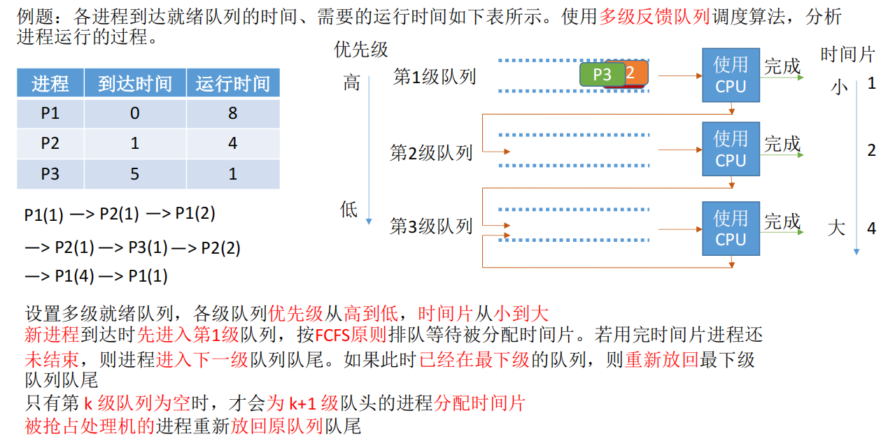

| 算法         | 思想&规则 | 可抢占？                                   | 优点                           | 缺点                         | 会导致饥饿？ | 补充                                                      |
| ------------ | --------- | ------------------------------------------ | ------------------------------ | ---------------------------- | ------------ | --------------------------------------------------------- |
| 时间片轮转   |           | 抢占式                                     | 公平，适用于分时操作系统       | 频繁切换有开销，不区分优先级 | 不会         | 时间片太大或太小有何影响？                                |
| 优先级调度   |           | 有抢占式的，也有非抢占式的。注意做题的区别 | 区分优先级，适用于分时操作系统 | 可能会导致饥饿               | 会           | 动态/静态优先级。各类型进程如何设置优先级？如何调整优先级 |
| 多级反馈队列 |           | 抢占式                                     | 平衡优秀                       | 可能会导致饥饿               | 会           |                                                           |

注意：比起早期的批处理操作系统来说，由于计算机造价大幅降低，因此之后出现的交互式操作系统（包括分时操作系统、实时操作系统等）更注重系统的响应时间、公平性、平衡性等指标。而这几种算法恰好也能较好地满足交互式系统的需求。因此这三种算法适合用于`交互式系统`。