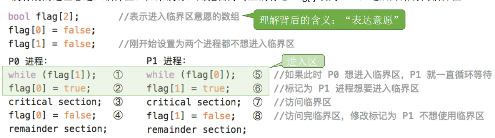

# 2-3 进程同步和互斥

## 1. 概念

`进程同步`：并发性带来了异步性，有时需要通过进程同步解决这种异步问题。有的进程之间需要相互配合地完成工作，各进程地工作推进需要遵循一定的先后顺序。

`临界资源`：一个时间段内只允许一个进程使用的资源称为临界资源。对临界资源的访问必须互斥进行，亦称为间接制约关系。

`进程互斥`：当一个进程访问某临界资源时，另一个想要访问该临界资源的进程必须等待。当前访问临界资源的进程访问结束，释放资源之后，另一个进程才能去访问临界资源。

对临界资源的互斥访问，可在逻辑上分为如下四个部分：

注意：
1. `临界区（临界段）`：`进程中访问临界资源的代码段`
2. `进入区`和`退出区`是`负责实现互斥的代码段`。

为了`实现对临界资源的互斥访问`，同时`保证系统整体性能`，需要`遵循以下原则`：
1. `空闲让进`。临界区空闲时，可以允许一个请求进入临界区的进程立即进入临界区。
2. `忙则等待`。当已有进程进入临界区时，其他试图进入临界区的进程必须等待。
3. `有限等待`。对请求访问的进程，应保证能在有限时间进入临界区（保证不会饥饿）。
4. `让权等待`：当进程不能进入临界区时，应立即释放处理机，防止进程忙等待。

## 2. 实现互斥的软件实现方式

1. 单标志法
2. 双标志先检查
3. 双标志后检查
4. Peterson算法

### 2.1 单标志法

`算法思想`：两个进程在`访问完临界区后`会把使用临界区的权限转交给另一个进程。也就是说`每个进程进入临界区的权限只能被另一个进程赋予`。

turn的初值为0，即刚开始只允许0号进程进入临界区。

若P1先上处理机运行，则会一直卡在⑤。直到P1的时间片用完，发生调度，切换P0上处理机运行。代码 ① 不会卡住 P0，P0 可以正常访问临界区，在 P0 访问临界区期间即时切换回 P1，P1依然会卡在 ⑤。只有 P0 在退出区将 turn 改为 1 后，P1才能进入临界区。

缺点：只能按 P0 -> P1 -> P0 -> P1 -> ……这样轮流访问。如果此时允许进入临界区的进程是 P0，而 P0 一直不访问临界区，那么虽然此时临界区空闲，但是并不允许 P1 访问。单标志法存在的主要问题是：`违背“空闲让进”原则`。

### 2.2 双标志先检查法

`算法思想`：设置一个布尔型数组flag[]，数组中各个元素用来标记各进程进入临界区的意愿。比如 “flag[0] = ture”意味着 0 号进程 P0 现在想要进入临界区。每个进程在进入临界区之前先检查当前有 没有别的进程想进入临界区，如果没有，则把自身对应的标志 flag[i] 设为 true，之后开始访问临界区。

`缺点`：若按照 ①⑤②⑥③⑦….的顺序执行，P0 和 P1 将会同时访问临界区。
因此，双标志先检查法的主要问题是：违反“忙则等待”原则。原因在于，进入区的“检查”和“上锁” 两个处理不是一气呵成的。“检查”后，“上锁”前可能发
生进程切换。

### 2.3 双标志后检查法

`算法思想`：双标志先检查法的改版。前一个算法的问题是先“检查”后“上锁”，但是这两个操作又无法一气呵成，因此导致了两个进程同时进入临界区的问题。因此，人们又想到先“上锁”后“检查”的方法，来避免上述问题。

`缺点`：若按照 ①⑤②⑥….的顺序执行，P0 和 P1 将都无法进入临界区。因此，双标志后检查法虽然解决了`“忙则等待”`的问题，但是又违背了`“空闲让进”`和`“有限等待”`原则，会因各进程都长期无法访问临界资源而产生“饥饿”现象。两个进程都争着想进入临界区，但是谁也不让谁，最后谁都无法进入临界区。

### 2.4 Peterson算法

`算法思想`：结合双标志法、单标志法的思想。如果双方都争着想进入临界区，那可以让进程尝试“孔融让梨”（谦让）。

`缺点`：Peterson 算法用软件方法解决了进程互斥问题，遵循了`空闲让进、忙则等待、有限等待`三个原则，但是依然未遵循`让权等待`的原则。

## 3. 进程互斥的硬件实现方法

1. 中断屏蔽
2. TestAndSet(TS指令/TSL指令)
3. Swap指令(XCHG指令)

### 3.1 中断屏蔽

利用“开/关中断指令”实现。

- 优点：简单、高效
- 缺点：不适用于多处理机；只适用于操作系统内核进程，不适用于用户进程（因为开/关中断指令只能运行在内核态，这组指令如果能让用户随意使用会很危险）。

### 3.2 TestAndSet指令

TSL 指令是用硬件实现的，执行的过程不允许被中断，只能一气呵成。

若刚开始 lock 是 false，则 TSL 返回的 old 值为 false，while 循环条件不满足，直接跳过循环，进入临界区。若刚开始 lock 是 true，则执行 TLS 后 old 返回的值为 true，while 循环条件满足，会一直循环，直到当前访问临界区的进程在退出区进行“解锁”。

相比软件实现方法，TSL 指令把“上锁”和“检查”操作用硬件的方式变成了一气呵成的原子操作。

- 优点：实现简单，无需像软件实现方法那样严格检查是否会有逻辑漏洞；适用于多处理机环境
- 缺点：不满足“让权等待”原则，暂时无法进入临界区的进程会占用CPU并循环执行TSL指令，从而导致“忙等”。

### 3.3 Swap指令

Exchange指令，XCHG指令。

Swap指令是用硬件实现的，执行的过程不允许被中断，只能一气呵成。

逻辑上来看 Swap 和 TSL 并无太大区别，都是先记录下此时临界区是否已经被上锁（记录在 old 变量上），再将上锁标记 lock 设置为 true，最后检查 old，如果 old 为 false 则说明之前没有别的进程对临界区上锁，则可跳出循环，进入临界区。

- 优点：实现简单，无需像软件实现方法那样严格检查是否会有逻辑漏洞；适用于多处理机环境
- 缺点：不满足“让权等待”原则，暂时无法进入临界区的进程会占用CPU并循环执行TSL指令，从而导致“忙等”。

# 4. 信号量

`信号量`其实就是一个变量（可以是一个整数，也可以是复杂的记录型变量），可以用一个信号量来表示`系统中某种资源的数量`。

`一对原语`：`wait(S)`原语和`signal(S)`原语，可以把原语理解为我们自己写的函数，函数名为wait和signal，括号里的`信号量S`其实就是函数调用时传入的一个参数。

wait、signal原语常简称为`P、V操作`（荷兰语proberen和verhogen）。因此，做题的时候常把wait(S)、signal(S)两个操作分别写为`P(S)、V(S)`。

## 4.1 整数型信号量

用一个`整数型的变量`作为信号量，用来`表示系统中某种资源的数量`。

`与普通整数变量的区别`：对信号量的操作只有三种，初始化、P操作、V操作。

wait和signal是一对原语，保证了`“检查”和“上锁”一气呵成`，避免了并发、异步导致的问题。

存在的问题：不满足`让权等待`，会发生`忙等`。

## 4.2 记录型信号量

`初始化`：S.value 的初值表示系统中某种资源的数目。

P操作：进程请求一个单位的该类资源，因此需要执行 S.value--，表示资源数减1，当S.value < 0 时表示该类资源已分配完毕，因此进程应调 用 block 原语进行自我阻塞（当前运行的进程从运行态->阻塞态），主动放弃处理机，并插入该类资源的等待队列 S.L 中。可见，该机制遵循了“让权等待”原则，
不会出现“忙等”现象。

V操作：进程释放一个单位的该类资源，因此需要执行 S.value++，表示资源数加1，若加1后仍是 S.value <= 0，表示依然有进程在等待该类资源，因此应调用 wakeup 原语唤醒等待队列中的第一个进程（被唤醒进程从阻塞态->就绪态）

`优点`：`解决了忙等待问题`。

## 5. 使用信号量处理同步互斥问题

### 5.1 使用信号量处理互斥问题

1. 分析并发进程的关键活动，划定临界区
2. `设置互斥信号量 mutex，初值为1`
3. `在进入区 P(mutex)——申请资源`
4. `在退出区 V(mutex)——释放资源`

注意：对`不同的临界资源`需要`设置不同的互斥信号量`。`P、V操作必须成对出现`。缺少P(mutex) 就不能保证临界资源的互斥访问。缺少 V(mutex) 会导致资源永不被释放，等待进程永不被唤醒。

### 5.2 使用信号量实现进程同步

1. 分析什么地方需要实现“同步关系”，即必须保证“一前一后”执行的两个操作（或两句代码）
2. 设置同步信号量 S, 初始为 0
3. 在“前操作”之后执行 V(S)
4. 在“后操作”之前执行 P(S)

注意：信号量S代表“某种资源”，刚开始是没有这种资源的。P2需要使用这种资源，而又只能由P1产生这种资源。

若先执行到 V(S) 操作，则 S++ 后 S=1。之后当执行到 P(S) 操作时，由于 S=1，表示有可用资源，会执行 S--，S 的值变回 0，P2 进程不会执行 block 原语，而是继续往下执行代码4。

若先执行到 P(S) 操作，由于 S=0，S-- 后 S=-1，表示此时没有可用资源，因此P操作中会执行 block 原语，主动请求阻塞。之后当执行完代码2，继而执行 V(S) 操作， S++，使 S 变回 0，由于此时有进程在该信号量对应的阻塞队列中，因此会在 V 操作中执行 wakeup 原语，唤醒 P2 进程。这样 P2 就可以继续执行 代码4 了。

### 5.3 信号量机制实现前驱关系

其实每一对前驱关系都是一个进程同步问题（需要保证一前一后的操作）。因此，
1. 要为每一对前驱关系各设置一个同步信号量
2. 在“前操作”之后对相应的同步信号量执行 V 操作
3. 在“后操作”之前对相应的同步信号量执行 P 操作

