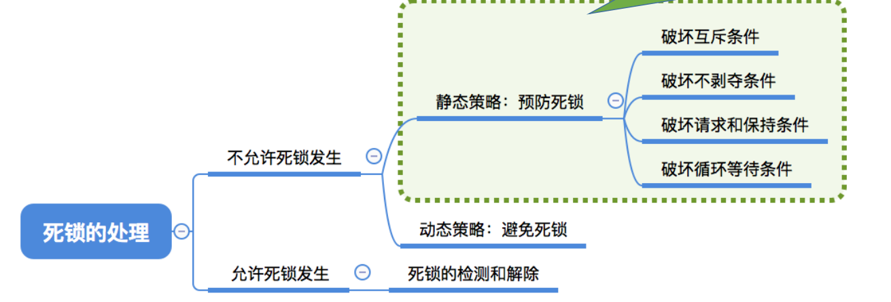
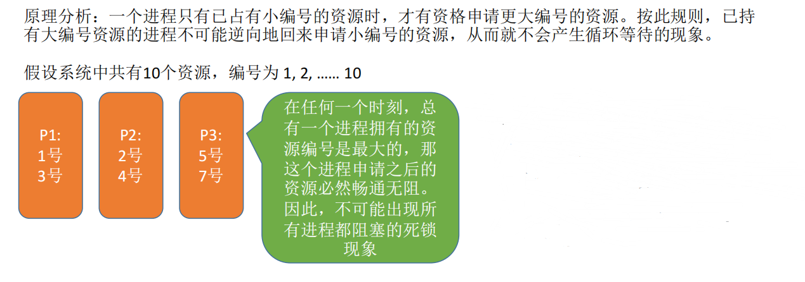
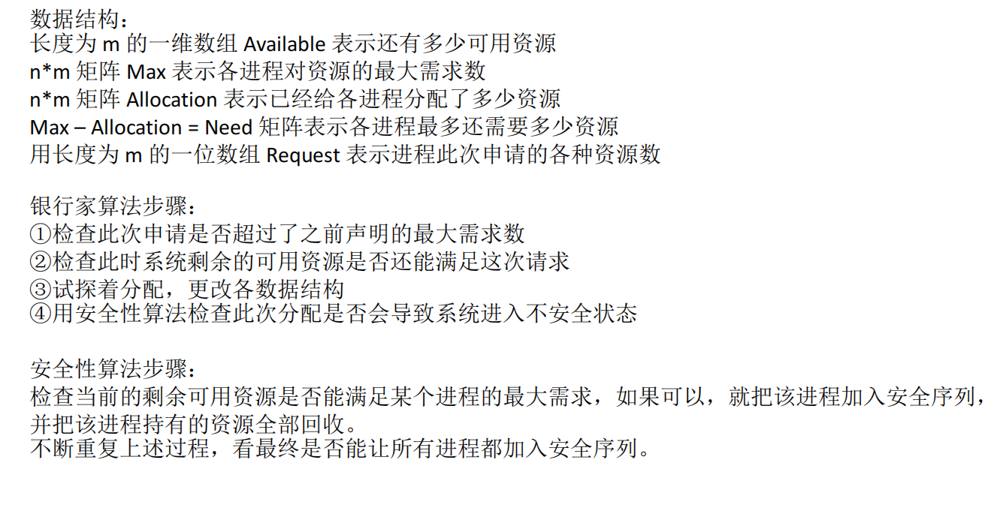
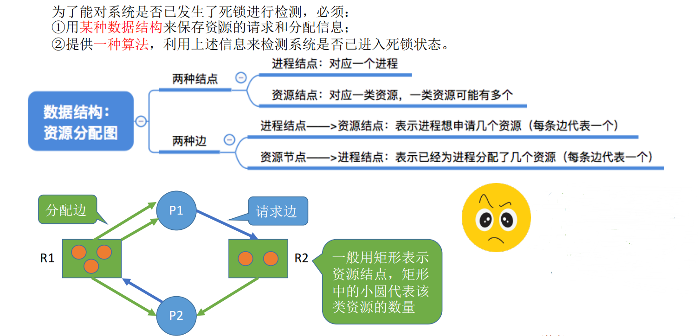

# 2-4.死锁

## 1. 死锁的相关概念

`死锁`：`各进程互相等待对方手里的资源，导致各进程都阻塞，无法向前推进的现象`。

`饥饿`：`由于长期得不到想要的资源，某进程无法向前推进的现象`。

`死循环`：`某进程执行过程中一直跳不出某个循环的现象`。

| 现象   | 共同点                                                 | 区别                                                                                                                                                                                                                                                               |
| ------ | ------------------------------------------------------ | ------------------------------------------------------------------------------------------------------------------------------------------------------------------------------------------------------------------------------------------------------------------ |
| 死锁   | 都是进程无法顺利向前推进的现象（故意设计的死循环除外） | 死锁一定是“循环等待对方手里的资源”导致的，因此如果有死锁现象，那`至少有两个或两个以上的进程同时发生死锁`。另外，发生死锁的进程一定处于阻塞态。                                                                                                                       |
| 饥饿   | 同上                                                   | `可能只有一个进程发生饥饿`。发生饥饿的进程既可能是阻塞态(如长期得不到需要的I/O设备)，也可能是就绪态(长期得不到处理机)                                                                                                                                                |
| 死循环 | 同上                                                   | 可能只有一个进程发生死循环。死循环的进程可以上处理机运行（可以是运行态），只不过无法像期待的那样顺利推进。死锁和饥饿问题是由于操作系统分配资源的策略不合理导致的，而死循环是由代码逻辑的错误导致的。`死锁和饥饿是管理者（操作系统）的问题，死循环是被管理者的问题`。 |

`死锁产生的必要条件`：
1. 互斥条件：只有对`必须互斥使用的资源的争抢`才会导致死锁
2. 不剥夺条件：进程所获得的资源在未使用完之前，`不能由其他进程强行夺走，只能主动释放`。
3. 请求和保持条件：进程`已经保持了至少一个资源`，但又提出了新的资源`请求`，而该资源又被其他进程占有，此时请 求进程被阻塞，但又对自己已有的资源`保持`不放。
4. 循环等待条件：存在一种进程`资源的循环等待链`，链中的每一个进程已获得的资源同时被下一个进程所请求。

`注意：发生死锁时一定有循环等待，但是发生循环等待时未必死锁（循环等待是死锁的必要不充分条件）`。

如果同类资源数大于1，则即使有循环等待，也未必发生死锁。但如果系统中每类资源都只有一个，那循环等待就是死锁的充分必要条件。

发生死锁的情况：
1. 对系统资源的竞争。
2. 进程推进顺序非法。
3. 信号量的使用不当也会造成死锁。

总之，`对不可剥夺资源的不合理分配，可能导致死锁`。

`死锁的处理策略`：
1. 预防死锁：破坏死锁产生的四个必要条件中的一个或多个。
2. 避免死锁：用某种方法防止系统进入不安全状态，从而避免死锁（银行家算法）。
3. 死锁的检测和解除：允许死锁的发生，不过操作系统会负责检测出死锁的发生，然后采取某种措施解除死锁。

## 2. 预防死锁

### 2.1 破坏互斥条件

`互斥条件`：只有对必须互斥使用的资源的争抢才会导致死锁。

如果`把只能互斥使用的资源改造为允许共享使用，则系统不会进入死锁状态`。比如: `SPOOLing技术`。

`缺点`：并不是所有的资源都可以改造成可共享使用的资源。并且为了系统安全，很多地方还必须保护这种互斥性。因此，很多时候都无法破坏互斥条件。

### 2.2 破坏不剥夺条件

`不剥夺条件`：进程所获得的资源在未使用完之前，不能由其他进程强行夺走，只能主动释放。

破坏不剥夺条件：
1. 当某个进程请求新的资源得不到满足时，它必须立即释放保持的所有资源，待以后需要时再重新申请。也就是说，即使某些资源尚未使用完，也需要主动释放，从而破坏了不可剥夺条件。
2. 当某个进程需要的资源被其他进程所占有的时候，可以由操作系统协助，将想要的资源强行剥夺。这种方式一般需要考虑各进程的优先级。

`缺点`：
1. 实现起来比较复杂
2. 释放已获得的资源可能造成前一阶段工作的失效。因此这种方法一般只适用于易保存和恢复状态的资源，如CPU。
3. 反复地申请和释放资源会增加系统开销，降低系统吞吐量
4. 若采用方案一，意味着只要暂时得不到某个资源，之前获得的那些资源就都需要放弃，以后再重新申请。如果一直发生这样的情况，就会导致进程饥饿。

### 2.3 破坏请求和保持条件

`请求和保持条件`：进程`已经保持了至少一个资源`，但又提出了新的资源`请求`，而该资源又被其他进程占有，此时请求进程被阻塞，但又对自己已有的资源`保持不放`。

破坏请求和保持条件：
采用`静态分配方法`，即进程在运行前一次申请完它所需要的全部资源，在它的资源未满足前，不让它投入运行。一旦投入运行后，这些资源就一直归它所有，该进程就不会再请求其他任何资源。

`缺点`：`有些资源可能只需要用很短的时间，因此如果进程的整个运行期间都一直保持着所有资源，就会造成严重的资源浪费，资源利用率极低`。另外，该策略也有可能`导致某些进程饥饿`。

### 2.4 破坏循环等待条件

`循环等待条件`：存在一种`进程资源的循环等待链`，链中的每一个进程已获得的资源同时被下一个进程所请求。

`破坏循环等待条件`：
首先给系统中的资源编号，规定`每个进程必须按编号递增的顺序请求资源`，同类资源（即编号相同的资源）一次申请完。

`缺点`：
1. 不方便增加新的设备，因为可能需要重新分配所有的编号；
2. 进程实际使用资源的顺序可能和编号递增顺序不一致，会导致资源浪费；
3. 必须按规定次序申请资源，用户 编程麻烦。

## 3. 避免死锁

所谓`安全序列`，就是指如果系统按照这种序列分配资源，则每个进程都能顺利完成。`只要能找出一个安全序列`，系统就是`安全状态`。当然，`安全序列可能有多个`。如果分配了资源之后，`系统中找不出任何一个安全序列`，`系统就进入了不安全状态`。这就意味着之后可能所有进程都无法顺利的执行下去。

`如果有进程提前归还了一些资源`，那`系统也有可能重新回到安全状态`，不过我们在分配资源之前总是要考虑到最坏的情况。

`注意`：`如果系统处于安全状态，就一定不会发生死锁`。`如果系统进入不安全状态，就可能发生死锁`（`处于不安全状态未必就是发生了死锁，但发生死锁时一定是在不安全状态`）。

`可以在资源分配之前预先判断这次分配是否会导致系统进入不安全状态，以此决定是否答应资源分配请求`。这也是`“银行家算法”的核心思想`。

### 3.1 银行家算法

`核心思想`：`在进程提出资源申请时，先预判此次分配是否会导致系统进入不安全状态。如果会进入不安全状态，就暂时不答应这次请求，让该进程先阻塞等待`。

## 4. 死锁的检测和解除

如果系统中既不采取预防死锁的措施，也不采取避免死锁的措施，系统就很可能发生死锁。在这种情况下，系统应当提供两个算法：
①死锁检测算法：用于检测系统状态，以确定系统中是否发生了死锁。
②死锁解除算法：当认定系统中已经发生了死锁，利用该算法可将系统从死锁状态中解脱出来。

`检测死锁的算法`：
1）在资源分配图中，找出既不阻塞又不是孤点的进程 Pi（即找出一条有向边与它相连，且该有向边对应资源的申请数量小于等于系统中已有空闲资源数量。如下图中，R1没有空闲资源，R2有
一个空闲资源。若所有的连接该进程的边均满足上述条件，则这个进程能继续运行直至完成，然后释放它所占有的所有资源）。消去它所有的请求边和分配变，使之称为孤立的结点。在下图中，P1 是满足这一条件的进程结点，于是将P1的所有边消去。
2）进程 Pi 所释放的资源，可以唤醒某些因等待这些资源而阻塞的进程，原来的阻塞进程可能变为非阻塞进程。在下图中，P2 就满足这样的条件。根据 1）中的方法进行一系列简化后，若能消去途中所有的边，则称该图是可完全简化的。

`死锁定理`：如果某时刻系统的资源分配图是不可完全简化的，那么此时系统死锁。

`一旦检测出死锁的发生，就应该立即解除死锁。`
补充：`并不是系统中所有的进程都是死锁状态，用死锁检测算法化简资源分配图后，还连着边的那些进程就是死锁进程`。

解除死锁的主要方法有：
1. `资源剥夺法`。挂起（暂时放到外存上）某些死锁进程，并抢占它的资源，将这些资源分配给其他的死锁进程。但是应防止被挂起的进程长时间得不到资源而饥饿。
2. `撤销进程法（或称终止进程法）`。强制撤销部分、甚至全部死锁进程，并剥夺这些进程的资源。这种方式的优点是实现简单，但所付出的代价可能会很大。因为有些进程可能已经运行
了很长时间，已经接近结束了，一旦被终止可谓功亏一篑，以后还得从头再来。
3. `进程回退法`。让一个或多个死锁进程回退到足以避免死锁的地步。这就要求系统要记录进程的历史信息，设置还原点。