# 1. 内存管理

## 1.1 内存基础知识

内存地址从0开始，`每个地址对应一个存储单元`。

`按字节编址`和`按位编址`：
1. 按字节编址：每个存储单元一个字节
2. 按字编址：每个存储单元大小为一个字

逻辑地址：相对地址，物理地址：绝对地址

### 1.1.1 写程序到程序运行的步骤

1. 编辑源代码文件
2. 编译：由源代码文件生成目标模块（“高级语言”翻译为“机器语言”）
3. 链接：由目标模块生成装入模块，链接后形成完整的逻辑地址
4. 装入：将装入模块装入内存，装入后形成物理地址。

### 1.1.2 链接的三种方式

1. 静态链接：在程序运行之前，先将各目标模块及它们所需的库函数连接成一个完整的可执行文件（装入模块），之后不再拆开。
   
2. 装入时动态链接：将目标模块装入内存时，边装入边链接的方式。
   
   
3. 运行时动态链接：在程序执行中需要该目标模块时，才对它进行链接。其优点是便于修改和更新，便于实现对目标模块的共享。
   

### 1.1.3 装入的三种方式

1. 绝对装入：在编译时，如果知道程序将放到内存中的哪个位置，编译程序将产生绝对地址的目标代码。装入程序按照装入模块中的地址，将程序和数据装入内存。
   如果知道装入模块要从地址为 100 的地方开始存放：
   

   绝对装入只适用于单道程序环境。
   程序中使用的绝对地址，可在编译或汇编时给出，也可由程序员直接赋予。通常情况下都是编译或汇编时再转换为绝对地址。
2. 静态重定位：又称`可重定位装入`。`编译、链接后的装入模块的地址都是从0开始的`，`指令中使用的地址、数据存放的地址都是相对于起始地址而言的逻辑地址`。`可根据内存的当前情况，将装入模块装入到内存的适当位置`。`装入时对地址进行“重定位”，将逻辑地址变换为物理地址`（地址变换是在装入时一次完成的）。
   

   静态重定位的特点是在一个作业装入内存时，必须分配其要求的全部内存空间，如果没有足够的内存，就不能装入该作业。 作业一旦进入内存后，在运行期间就不能再移动，也不能再申请内存空间。
3. 动态重定位：又称`动态运行时装入`。`编译、链接后的装入模块的地址都是从0开始的`。`装入程序把装入模块装入内存后，并不会立即把逻辑地址转换为物理地址，而是把地址转换推迟到程序真正要执行时才进行`。因此`装入内存后所有的地址依然是逻辑地址`。这种方式需要一个`重定位寄存器`的支持。
   

   

## 1.2 内存管理基本概念

内存管理的职责：
1. 内存空间的分配和回收
2. 内存空间的扩充
3. 地址转换：操作系统负责实现逻辑地址到物理地址的转换
   1. 绝对装入：编译器负责地址转换（单道程序阶段，无操作系统）
   2. 可重定位装入：装入程序负责地址转换（早期多道批处理阶段）
   3. 动态运行时装入：运行时才进行地址转换（现代操作系统）
4. 存储保护：保证各进程在各自存储空间内运行，互不干扰

## 1.3 存储保护

存储保护：保证各进程在各自存储空间内运行，互不干扰

存储保护的方法：
1. 在CPU中设置上下限寄存器，存放进程的上、下限地址。。进程的指令要访问某个地址时，CPU检查是否越界。
   
2. 采用`重定位寄存器`（又称`基址寄存器`）和`界地址寄存器`（又称`限长寄存器`）进行越界检查。`重定位寄存器中存放的是进程的起始物理地址。界地址寄存器中存放的是进程的最大逻辑地址`。
   

## 1.4 内存空间的扩充

内存空间的扩充的实现采用如下几种技术：
1. 覆盖技术
2. 交换技术
3. 虚拟存储技术

### 1.4.1 覆盖技术

覆盖技术用来解决“程序大小超过物理内存总和”的问题。

覆盖技术的思想：将程序分为多个段（多个模块）。常用的段常驻内存，不常用的段在需要时调入内存。

内存中分为一个“固定区”和若干个“覆盖区”。

`需要常驻内存的段放在“固定区”中，调入后就不再调出（除非程序运行结束）。不常用的段放在“覆盖区”，需要用到时调入内存，用不到时调出内存。`

`缺点`：必须由程序员声明覆盖结构，操作系统自动完成覆盖。对用户不透明，增加了用户编程负担。

### 1.4.2 交换技术

交换技术的设计思想：内存空间紧张时，系统将内存中某些进程暂时换出外存，把外存中某些已经具备运行条件的进程换入内存（进程在内存与磁盘间动态调度）。

中级调度（内存调度），就是要决定哪个处于挂起状态的进程重新调入内存。

暂时换出外存等待的进程状态为挂起状态（挂起态，suspend）

挂起态又可以进一步细分为就绪挂起、阻塞挂起两种状态

1. 具有对换功能的操作系统中，通常把磁盘空间分为文件区和对换区两部分。文件区主要用于存放文件，主要追求存储空间的利用率，因此对文件区空间的管理采用离散分配方式；对换区空间只占磁盘空间的小部分，被换出的进程数据就存放在对换区。由于对换的速度直接影响到系统的整体速度，因此对换区空间的管理主要追求换入换出速度，因此通常对换区采用连续分配方式（学过文件管理章节后即可理解）。总之，对换区的I/O速度比文件区的更快。
2. 交换通常在许多进程运行且内存吃紧时进行，而系统负荷降低就暂停。例如：在发现许多进程运行时经常发生缺页，就说明内存紧张，此时可以换出一些进程；如果缺页率明显下降，就可以暂停换出。
3. 可优先换出阻塞进程；可换出优先级低的进程；为了防止优先级低的进程在被调入内存后很快又被换出，有的系统还会考虑进程在内存的驻留时间（注意：PCB 会常驻内存，不会被换出外存）。

## 1.5 内存空间的分配与回收

### 1.5.1 连续分配管理方式

`连续分配`：指为`用户进程`分配的是一个`连续的内存空间`。

1. 单一连续分配：在单一连续分配方式中，内存被分为`系统区`和`用户区`。系统区通常位于内存的低地址部分，用于存放操作系统相关数据；用户区存放用户进程相关数据。`内存中只能有一道用户程序，用户程序独占整个用户空间。`
   - 优点：
      - 实现简单
      - 无外部碎片
      - 可以采用覆盖技术扩充内存
      - 不一定需要采取内存保护
   - 缺点：
     - 只能用于单用户、单任务操作系统中
     - 有内部碎片（分配给某进程的内存区域中，如果有部分没有用上，就是“内存碎片”）
     - 存储器利用效率低

   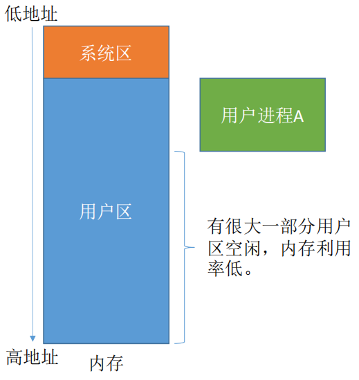
2. 固定分区分配：在支持多道程序的系统中，为了能在内存中装入多道程序，而这些程序之间不会相互干扰，于是将`整个用户空间划分为若干个固定大小的分区，在每个分区中只装入一道作业`。
   固定分区分配可划分为：  
      - 分区大小相等：`缺乏灵活性，但是很适合用于用一台计算机控制多个相同对象的场合。`
      - 分区大小不等：`增加了灵活性，可以满足不同大小的进程需求。根据常在系统中运行的作业大小情况进行划分。`
   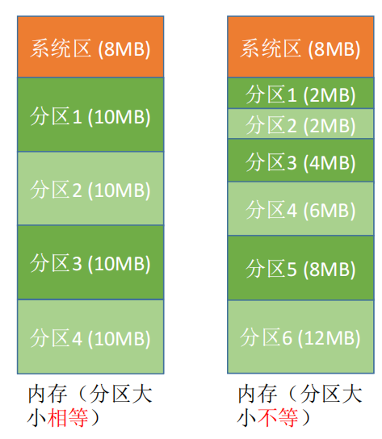

   操作系统需要建立`分区说明表`，来实现各个分区的分配和回收。每个表项对应一个分区，通常按照分区大小排列。`每个表项包含对应分区的大小、起始地址、状态（是否已分配）`

   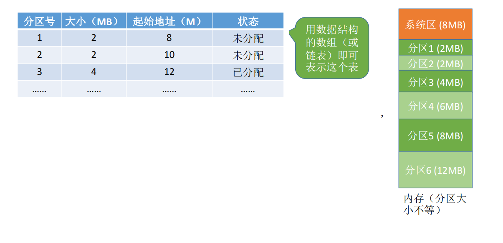

   当某用户程序要装入内存时，由操作系统内核程序按照用户程序大小检索该表，找到一个能满足大小的、未分配的分区，将之分配给该程序，然后修改状态为“已分配”。

   `优缺点`：
   - 优点：实现简单，无外部碎片
   - 缺点：
      1. 当用户程序太大时，可能所有的分区都不能满足需求，此时不得不采取覆盖技术来解决，但这又会降低性能。
      2. 会产生内部碎片，内存利用率低。

3. 动态分区分配
   
   `动态分区分配`又称为`可变分区分配`，这种分配方式`不会预先划分内存分区`，而是在进程装入内存时，`根据进程的大小动态地建立分区`，并使分区的大小正好适合进程的需要。因此系统分区的大小和数目是可变的。

   1. 系统要用什么样的数据结构记录内存的使用情况？
      1. 空闲分区表：每个空闲分区对应一个表项。表项中包含分区号、分区大小、分区起始地址等信息。
         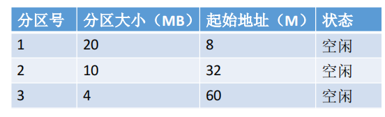
      2. 空闲分区链：每个分区的起始部分和末尾部分分别设置前向指针和后向指针。起始部分处还可以记录分区大小等信息。
         

   2. 当很多个空闲分区都能满足需求时，应选择哪个分区进行分配？
      把一个新作业装入内存时，须按照一定的`动态分区分配算法`，从空闲分区表（或空闲分区链）中选出一个分区分配给该作业。

   动态分区分配没有内部碎片，但是有外部碎片。

   如果内存中空闲空间的总和本来可以满足某进程的要求，但由于进程需要的是一整块连续的内存空间，因此这些“碎片”不能满足进程的需求。`可以通过紧凑（拼凑）技术来解决外部碎片`。

   回收内存分区时，可能遇到四种情况：
   1. 回收区之后有相邻的空闲分区
   2. 回收区之前有相邻的空闲分区
   3. 回收区前后都有相邻的空闲分区
   4. 回收区前后都没有相邻的空闲分区

   `总之，相邻的空闲分区要合并。`

### 1.5.2 动态分区分配算法

1. 首次适应算法
   
   `算法思想`：每次都从低地址开始查找，找到第一个能满足大小的空闲分区。

   `如何实现`：空闲分区`以地址递增的次序排列`。`每次分配内存时顺序查找空闲分区链（或空闲分区表），找到大小能满足要求的第一个空闲分区`。

2. 最佳适应算法

   `算法思想`：由于动态分区分配是一种连续分配方式，为各进程分配的空间必须是连续的一整片区域。因此为了保证当“大进程”到来时能有连续的大片空间，可以尽可能多地留下大片的空闲区，即，优先使用更小的空闲区。

   `如何实现`：空闲分区`按容量递增次序链接`。每次分配内存时顺序查找空闲分区链（或空闲分区表），找到大小能满足要求的第一个空闲分区。

   缺点：`每次都选最小的分区进行分配，会留下越来越多的、很小的、难以利用的内存块。因此这种方法会产生很多的外部碎片。`

3. 最坏适应算法
   
   又称`最大适应算法`。

   `算法思想`：为了解决最佳适应算法的问题——即留下太多难以利用的小碎片，可以在每次分配时优先使用最大的连续空闲区，河阳分配后剩余的空闲区就不会太小，更方便使用。

   `如何实现`：空闲分区按照容量递减次序链接。每次分配内存时顺序查找空闲分区链（或空闲分区表），找到大小能满足要求的第一个空闲分区。

   缺点：`每次都选最大的分区进行分配，虽然可以让分配后留下的空闲区更大，更可用，但是这种方式会导致较大的连续空闲区被迅速用完。如果之后有“大进程”到达，就没有内存分区可用了。`

4. 邻近适应算法

   `算法思想`：首次适应算法每次都从链头开始查找的。这可能会导致低地址部分出现很多小的空闲分区，而每次分配查找时，都要经过这些分区，因此也增加了查找的开销。如果每次都从上次查找的结束位置开始检索，就能解决上述问题。

   `如何实现`：空闲分区以地址递增的顺序排列（可排成一个循环链表）。每次分配内存时从上次查找结束的位置开始查找空闲分区链（或空闲分区表），找到大小能满足要求的第一个空闲分区。

## 1.6 非连续分配管理方式

`非连续分配`：为用户进程分配的可以是一些`分散的内存空间`。

### 1.6.1 基本分页存储管理

将内存空间分为一个个`大小相等的分区`，每个分区就是一个`“页框”`（`页框=页帧=内存块=物理块=物理页面`）。每个页框有一个编号，即`“页框号”`（`页框号=页帧号=内存块号=物理块号=物理页号`），页框号`从0开始`。

将`进程的逻辑地址空间`也分为与`页框大小相等`的一个个部分，每个部分称为一个`“页”`或`“页面”`。每个页面也有一个编号，即`“页号”`，页号也是`从0开始`。

操作系统`以页框为单位为每个进程分配内存空间`。进程的每个页面分别放入一个页框中，也就是说，进程的`页面`与内存的`页面`有`一一对应`的关系。各个页面不必连续存放，可以放到不相邻的各个页框中。

注：进程的最后一个页面可能没有一个页框那么大。也就是说，分页存储有可能产生内部碎片，因此`页框不能太大，否则可能产生过大的内部碎片造成浪费`。

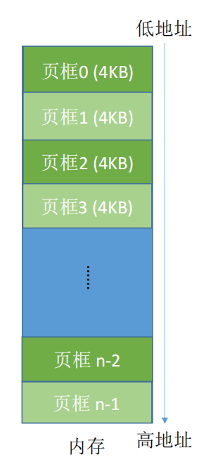

为了能知道进程的每个页面在内存中存放的位置，操作系统要为每个进程建立一张`页表`。注：页表通常存在PCB（进程控制块）中。

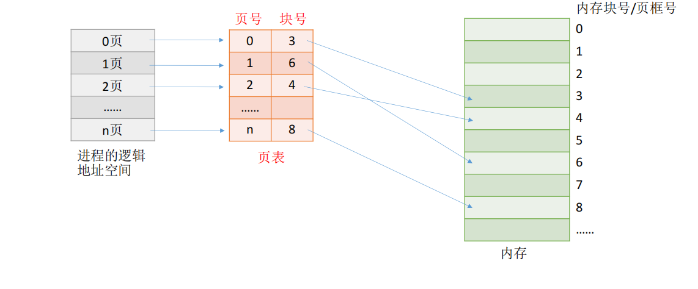

1. 一个进程对应一张页表
2. 进程的每个页面对应一个页表项
3. 每个`页表项`由“页号”和“块号”组成
4. 页表记录进程`页面`和实际存放`内存块`之间的`映射关系`
5. 每个页表项的长度是相同的。

`计算机中内存块的数量->页表项中块号至少占多少字节`。

假设某系统物理内存大小为 4GB，页面大小为 4KB，则每个页表项至少应该为多少字节？

`内存块大小`=`页面大小`=4KB= 2^12 B 
-> 4GB 的内存总共会被分为 2^32/2^12 = 2^20个内存块
-> 内存块号的范围应该是 0 ~ 2^20 -1 
-> 内存块号至少要用 20 bit 来表示
-> 至少要用`3B`来表示`块号`（3*8=24bit）（注意：页表记录的只是内存块号，而不是内存块的起始地址！`J号内存块的起始地址=J * 内存块大小`）
-> 由于`页号`是`隐含`的，因此`每个页表项占3B`，存储整个页表至少需要`3*(n+1)B`

`页表项连续存放，因此页号可以是隐含的，不占存储空间`（类比数组）。

如果要访问逻辑地址A，则：
1. 确定逻辑地址A对应的“页号”P
   `页号=逻辑地址/页面长度（取除法的整数部分）`
2. 找到P号页面在内存中的起始地址（需要查页表）
3. 确定逻辑地址A的“页内偏移量”W
   `页内偏移量=逻辑地址%页面长度（取除法的余数部分）`

`逻辑地址A对应的物理地址=P号页面在内存中的起始地址+页内偏移量W`

在计算机内部，地址是用二进制表示的，如果`页面大小`刚好是`2的整数次幂`，则计算机硬件可以快速的把逻辑地址拆分为（页号，页内偏移量）。

如果每个页面大小为2^k B，用二进制数表示逻辑地址，则末尾K位即为业内偏移量，其余部分就是页号。

如果页面大小正好是2的整数幂，则只需要把页表中记录的物理块号拼接上业内偏移量就能得到对应的物理地址。

页面大小刚好是2的整数幂有什么好处？
1. 逻辑地址的拆分更加迅速——如果每个页面大小位2^k B，用二进制表示逻辑地址，则末尾K位即为页内偏移量，其余部分就是页号。
2. 物理地址的计算更加迅速——根据逻辑地址得到页号，根据页号查询页表从而找到页面存放的内存块号，将二进制表示的内存块号和页内偏移量拼接起来，就可以得到最终的物理地址。

地址结构包含两个部分：第一部分为页号，后一部分为页内偏移量W。

上图中，地址长度为32位，其中，0-11位为“页内偏移量”，或称“页内地址”；12-31位为“页号”。

如果有K位表示“页内偏移量”，则说明系统中一个页面大小为2^K个内存单元。如果有M位表示页号，则说明在该系统中，一个进程最多允许有2^M个页面。

### 1.6.2 基本地址变换结构

基本地址变换结构可以借助进程的页表将逻辑地址转换为物理地址。

通常会在系统中设置一个页表寄存器（PTR），存放页表在内存中的起始地址F和页表长度M。进程未执行时，页表地址和页表长度存放在PCB中，当进程被调度时，操作系统内核会把它们放到页表寄存器中。

注意：页面大小为2的整数幂，设页面大小为L，逻辑地址A到物理地址E的变换过程如下：

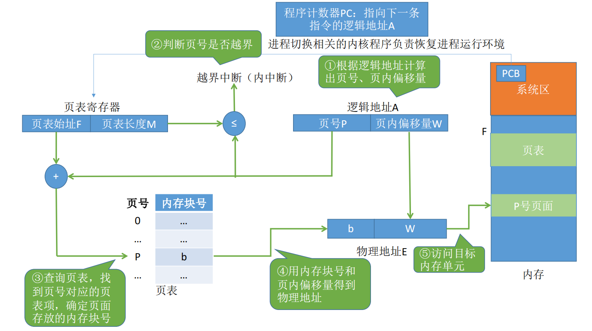

1. 计算页号P和页内偏移量W。
2. 比较页号P和页表长度M，若P>=M，则会产生越界中断
3. 页表中页号P对应的页表项地址=页表起始地址+页表项长度*页号。
4. 计算E = b * L + W，用得到的物理地址E去访存。

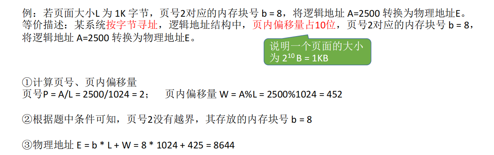

在分页存储管理（页式管理）的系统中，只要确定了每个页面的大小，逻辑地址结构就确定了。因此，`页式管理中地址是一维的`。即，`只要给出一个逻辑地址，系统就可以自动地算出页号、页内偏移量两个部分，并不需要显式地告诉系统这个逻辑地址中，页内偏移量占多少位`。

### 1.6.3 快表

快表，又称联想寄存器（TLB），是一种访问速度比内存快很多的高速缓存（TLB不是内存），用来存放最近访问的页表项的副本，可以加速地址变换速度。与此对应，内存中的页表常称为慢表。

1. CPU给出逻辑地址，由某个硬件算得页号、页内偏移量，将页号与快表中的所有页号进行比较。
2. 如果找到匹配的页号，说明要访问的页表项在快表中有副本，则直接从中取出该页对应的内存号，再将内存块号与页内偏移量拼接形成物理地址，最后访问该物理地址对应的内存单元。因此，若快表命中，则访问某个逻辑地址仅需一次访存即可。
3. 如果没有找到匹配的页号，则需要访问内存中的页表，找到对应页表项，得到页面存放的内存块号，再将内存块号与页内偏移量拼接形成物理地址，最后，访问该物理地址对应的内存单元。因此，若快表未命中，则访问某个逻辑地址需要两次访存（注意：在找到页表项之后，应同时将其存入快表，以便后面可能再次范根。但若快表已满，则必须按照一定的算法对旧的页表项进行替换）。

由于查询快表的速度比查询页表的速度快很多，因此只要快表命中，就可以节省很多时间。因为局部性原理，一般来说快表的命中率可以达到 90% 以上。

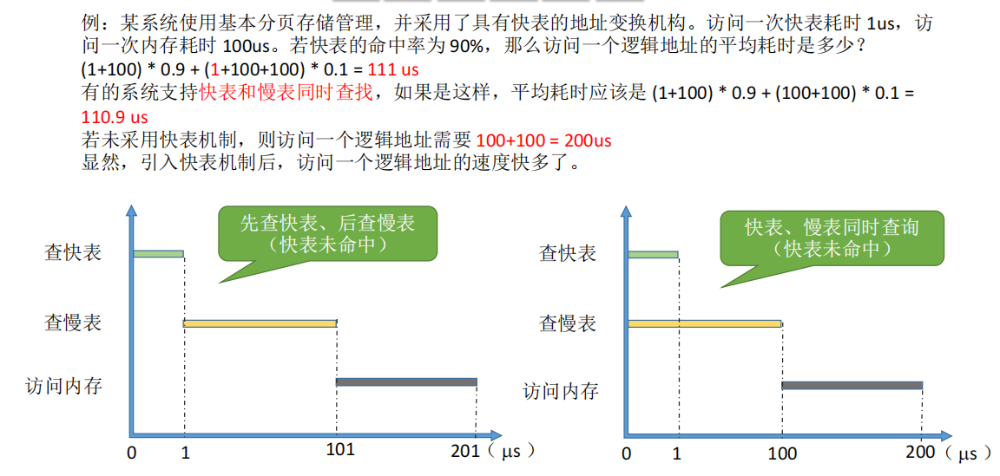

局部性原理：
1. 时间局部性：如果执行了程序中的某条指令，那么不久后这条指令很可能再次执行；如果某个数据被访问过，不久之后该数据很可能再次被访问。（因为程序中存在大量的循环）
2. 空间局部性：一旦程序访问了某个存储单元，在不久之后，其附近的存储单元也很有可能被访问。（因为很多数据在内存中都是连续存放的）。

TLB 和 普通 Cache 的区别——`TLB 中只有页表项的副本，而普通 Cache 中可能会有其他各种数据的副本`。

### 1.6.4 两级页表

#### 单级页表存在的问题

1. 页表必须连续存放，因此当页表很大时，需要占用很多个连续的页框。
2. 没有必要让整个页表常驻内存，因为进程在一段时间内可能只需要访问某几个特定的页面。
   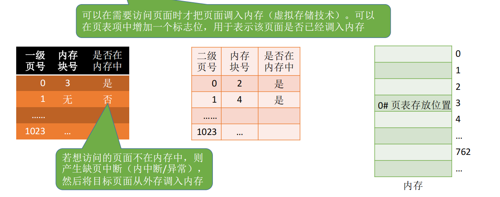

把页表再分页并离散存储，然后再建立一张页表记录页表各个部分的存放位置，称为页目录表，或称外层页表，或称顶层页表。

若分为两级页表后，页表依然很长，则可以采用更多级页表，一般来说`各级页表的大小不能超过一个页面`。

### 1.6.5 基本分段存储管理方式

`进程的地址空间`：按照程序`自身的逻辑`关系`划分为若干个段`，每个段都有一个段名（在低级语言中，程序员使用段名来编程），`每段从0开始编址`。

`内存分配规则`：以段为单位进行分配，每个段在内存中占据连续空间，但各段之间可以不相邻。

由于是按逻辑功能模块划分，用户`编程更方便，程序的可读性更高`。

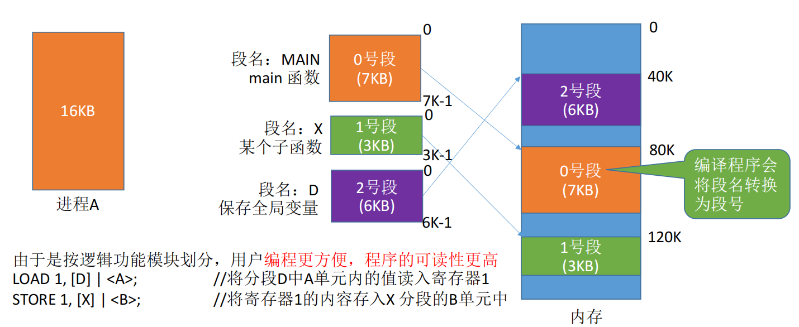

分段系统的逻辑地址结构由段号（段名）和段内地址（段内偏移量）所组成。

`段号的位数决定了每个进程最多可以分几个段`。`段内地址位数决定了每个段的最大长度是多少`。

程序分多个段，各段离散地装入内存，为了保证程序能正常运行，就必须能从物理内存中找到各个逻辑段的存放位置。为此，需要为每个进程建立一张段映射表，简称“`段表`”。

`每个段对应一个段表项`，其中记录了该段在内存中的`起始位置`（又称`“基址”`）和`段的长度`。

`各个段表项的长度是相同的`。`段号可以是隐含的，不占存储空间`。

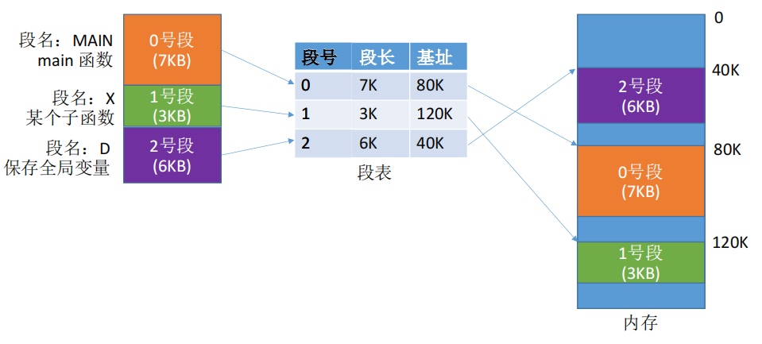

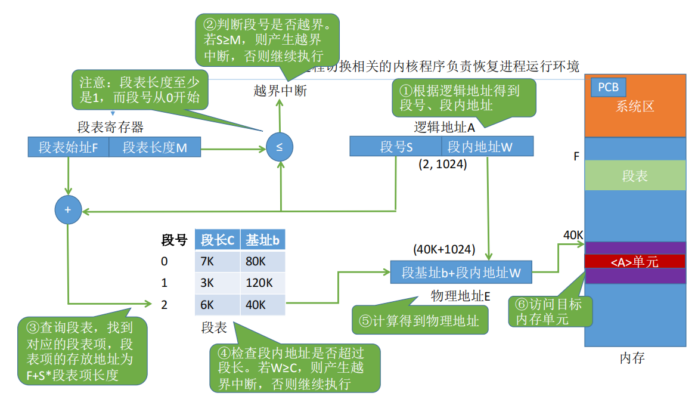

分段、分页管理的对比：
1. 
   `页是信息的物理单位`。分页的主要目的是为了实现离散分配，提高内存利用率。分页仅仅是系统管理上的需要，完全是系统行为，`对用户是不可见`。
   `段是信息的逻辑单位`。分段的主要目的是更好地满足用户需求。一个段通常包含着一组属于一个逻辑模块的信息。`分段对用户是可见的`，用户编程时需要显式地给出段名。
2. 页的大小固定且由系统决定。段的长度却不固定，决定于用户编写的程序。
3. 分页的用户进程地址空间是一维的，程序员只需给出一个记忆符即可表示一个地址。
   分段的用户进程地址空间是二维的，程序员在标识一个地址时，既要给出段名，也要给出段内地址。
4. 分段比分页更容易实现信息的共享和保护。
   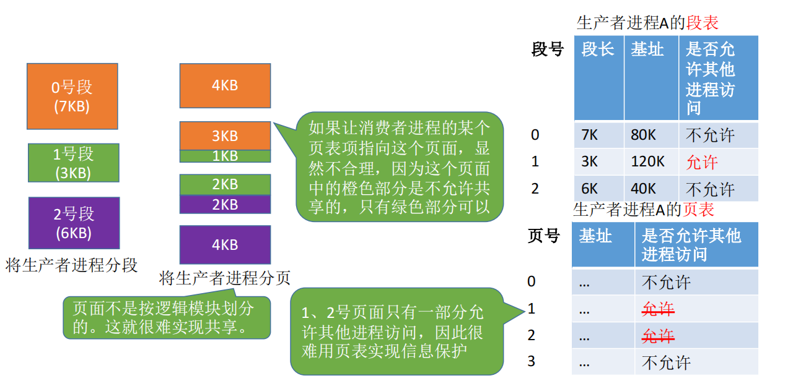
5. 访问一个逻辑地址需要几次访存？
   分页（单级页表）：第一次访存——查内存中的页表，第二次访存——访问目标内存单元。总共两次访存。
   分段：第一次访存——查内存中的段表，第二次访存——访问目标内存单元。总共两次访存与分页系统类似，分段系统中也可以引入快表机构，将近期访问过的段表项放到快表中，这样可以少一次访问，加快地址变换速度。

分段、分页的优缺点：
名称|优点|缺点
---|---|---
分页管理|内存空间利用率高，不会产生外部碎片，只会有少量的页内碎片|不方便按照逻辑模块实现信息的共享和保护
分段管理|很方便按照逻辑模块实现信息的共享和保护|如果段长过大，为其分配很大的连续空间会很不方便。另外，段式管理会产生外部碎片。（分段管理中产生的外部碎片也可以用“紧凑”来解决，只是需要付出较大的时间代价）

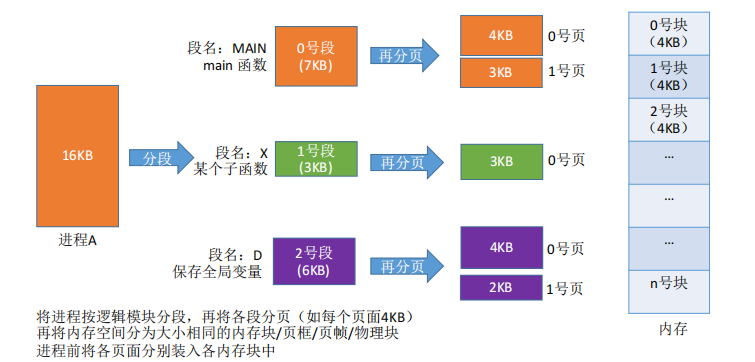

段页式系统的逻辑地址结构由段号、页号、页内地址（页内偏移量）组成。如：

31 ...  16| 15 ... 12| 11 ... 0
---|---|---
段号|页号|页内偏移量

段号的位数决定了每个进程最多可以分几个段，页号位数决定了每个段最大有多少页，页内偏移量决定了页面大小、内存块大小是多少。

“分段”对用户是可见的，程序员编程时需要显式地给出段号、段内地址。而将各段“分页”对用户是不可见的。系统会根据段内地址自动划分页号和页内偏移量。因此`段页式`管理的`地址结构是二维的`。

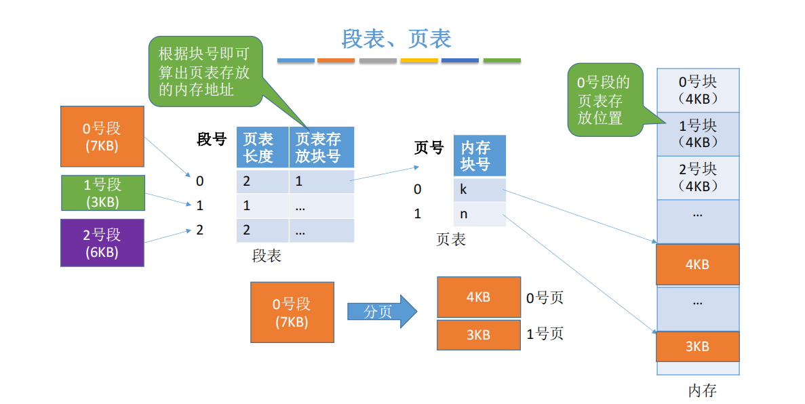

每个段对应一个段表项，每个段表项由段号、`页表长度、页表存放块号（页表起始地址）`组成。每个`段表项长度相等，段号是隐含的`。

每个页面对应一个页表项，每个页表项由页号、页面存放的内存块号组成。每个页表项长度相等，页号是隐含的。

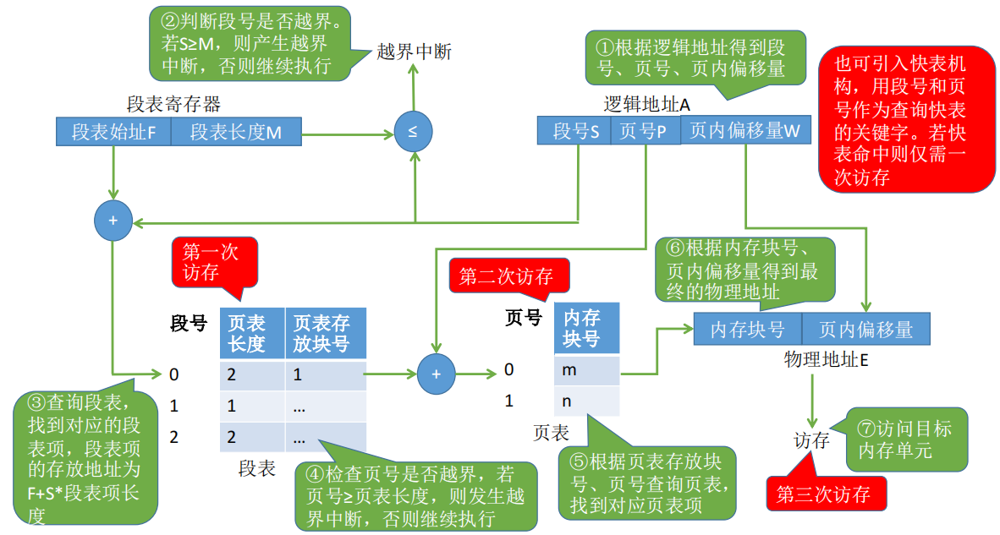

## 1.7 虚拟内存

传统存储管理方式的特征、缺点：
1. `一次性：作业必须一次性全部装入内存后才能开始运行`。
   这会带来两个问题：
   - `作业很大时，不能全部装入内存，导致大作业无法运行`。
   - 当大量作业要求运行时，由于内存无法容纳所有作业，因此只有少量作业能运行，导致`多道并发度下降`。
2. `驻留性`：`一旦作业被装入内存，就会一直驻留在内存中，直至作业运行结束`。事实上，在一个时间段内，只需要访问作业的一小部分数据即可正常运行，这就导致了内存中会驻留大量的、暂时用不到的数据，浪费了宝贵的内存资源。

### 1.7.1 局部性原理

`时间局部性`：如果执行了程序中的某条指令，那么不久后这条指令很有可能再次执行；如果某个数据被访问过，不久之后该数据很可能再次被访问（因为程序中存在大量的循环）。

`空间局部性`：一旦程序访问了某个存储单元，在不久之后，其附近的存储单元也很有可能被访问（因为很多数据在内存中都是连续存放的，并且程序的指令也是顺序地在内存中存放的）。

基于局部性原理，在程序装入时，可以将程序中`很快会用到的部分装入内存，暂时用不到的部分留在外存`，就可以让程序开始执行。

在程序执行过程中，`当所访问的信息不在内存时，由操作系统负责将所需信息从外存调入内存`，然后继续执行程序。

若内存空间不够，由`操作系统负责`将内存中`暂时用不到的信息换出到外存`。

在操作系统的管理下，在用户开来似乎有一个比实际内存大得多的内存，这就是`虚拟内存`。

虚拟内存由以下三个主要特征：
1. `多次性`：无需再作业运行时一次性全部装入内存，而是允许被分成多次调入内存
2. `对换性`：在作业运行时无需一直常驻内存，而是允许在作业运行过程中，将作业换入、换出
3. `虚拟性`：从逻辑上扩充了内存的容量，使用户看到的内存容量，远大于实际的容量。

虚拟内存技术，允许一个作业分多次调入内存。如果采用连续分配方式，会不方便实现。因此，虚拟内存的实现需要建立在离散分配的内存管理方式的基础上。

主要区别：

在执行过程中，当所访问的信息不存在内存时，由操作系统负责将所需信息从外存调入内存，然后继续执行程序。`操作系统要提供请求调页（请求调段）功能`。

若内存空间不够，由操作系统负责将内存中暂时用不到的信息换出到外存。`操作系统要提供页面置换（或段置换）的功能`。

#### 1.7.1.1 页表机制

与基本分页管理相比，请求分页管理中，为了实现“请求调页”，操作系统需要知道每个页面是否已经调入内存；如果还没调入，那么也需要知道该页面在外存中存放的位置。

当内存空间不够时，要实现“页面置换”，操作系统需要通过某些指标来决定到底换出哪个页面；有的页面没有修改过，就不用再浪费时间写回外存。有的页面修改过，就需要将外存中的旧数据覆盖，因此，操作系统也需要记录各个页面是否被修改的信息。

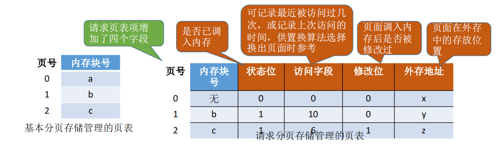

#### 1.7.1.2 缺页中断机制

在请求分页系统中，每当要访问的页面不在内存时，便产生一个缺页中断，然后由操作系统的缺页中断处理程序处理中断。

1. 此时缺页的进程阻塞，放入阻塞队列，调页完成后再将其唤醒，放回就绪队列。
2. 如果内存中由空闲块，则为进程分配一个空闲块，将所缺页面装入该块，并修改页表中响应的页表项。
3. 如果内存中没有空闲块，则由页面置换算法选择一个页面淘汰，若该页面在内存期间被修改过，则要将其写回外存。未修改过的页面不用写回外存。

`缺页中断`是因为当前执行的指令想要访问的目标页面未调入内存而产生的，因此`属于内中断一条指令`在执行期间，`可能产生多次缺页中断`。（如copy A to B，即将逻辑地址A中的数据复制到逻辑地址B，而A、B属于不同的页面，则有可能产生两次中断）

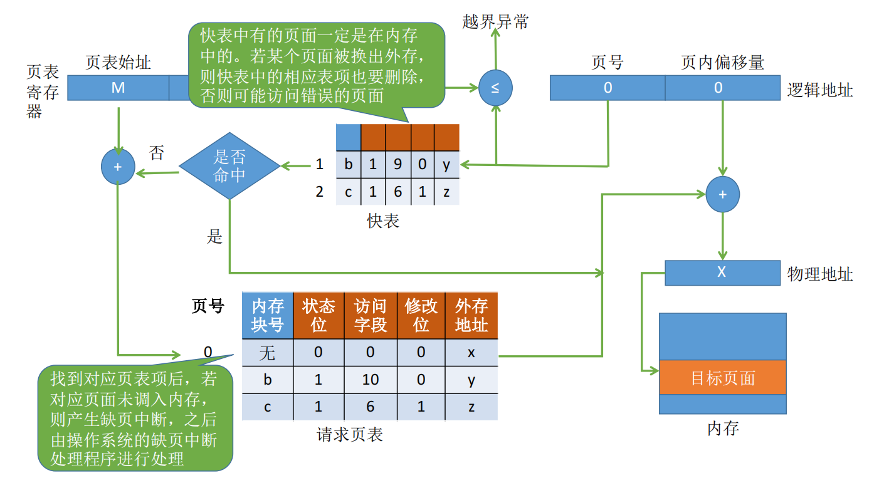

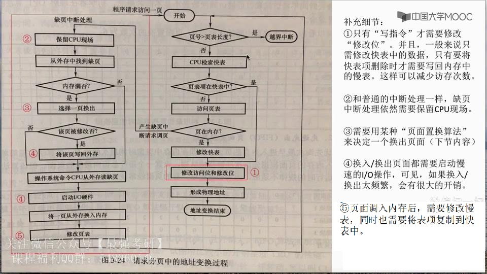

在具有快表机构的请求分页系统中，访问一个逻辑地址时，若发生缺页，则地址变换步骤是：
`查快表(未命中)——查慢表(发现未调入内存)——调页(调入的页面对应的表项会直接加入快表)——查快表(命 中)——访问目标内存单元`