# 1. 内存管理

## 1.1 内存基础知识

内存地址从0开始，`每个地址对应一个存储单元`。

`按字节编址`和`按位编址`：
1. 按字节编址：每个存储单元一个字节
2. 按字编址：每个存储单元大小为一个字

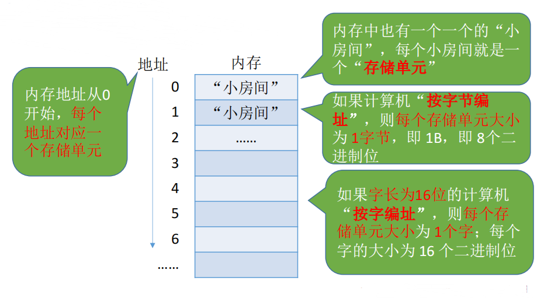

逻辑地址：相对地址，物理地址：绝对地址

### 1.1.1 写程序到程序运行的步骤

1. 编辑源代码文件
2. 编译：由源代码文件生成目标模块（“高级语言”翻译为“机器语言”）
3. 链接：由目标模块生成装入模块，链接后形成完整的逻辑地址
4. 装入：将装入模块装入内存，装入后形成物理地址。

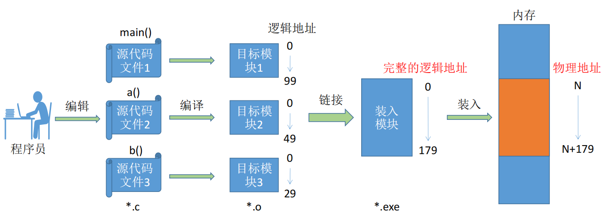

### 1.1.2 链接的三种方式

1. 静态链接：在程序运行之前，先将各目标模块及它们所需的库函数连接成一个完整的可执行文件（装入模块），之后不再拆开。
   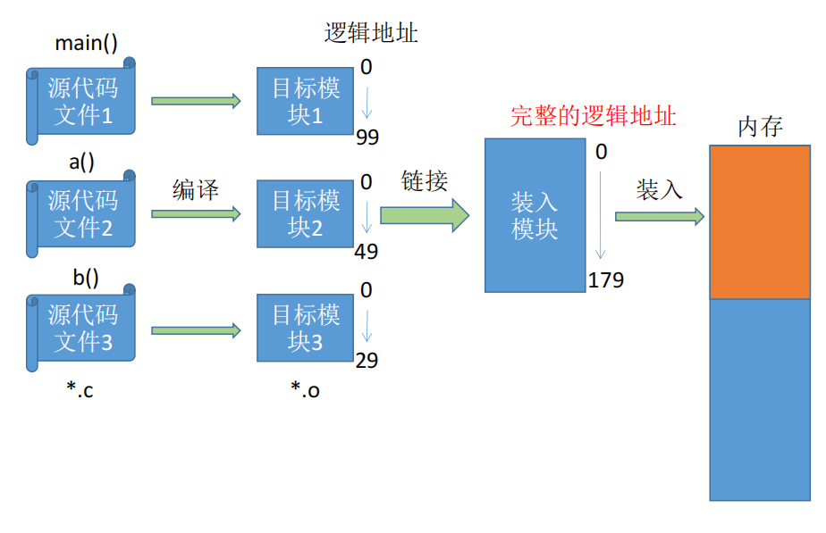
2. 装入时动态链接：将目标模块装入内存时，边装入边链接的方式。
   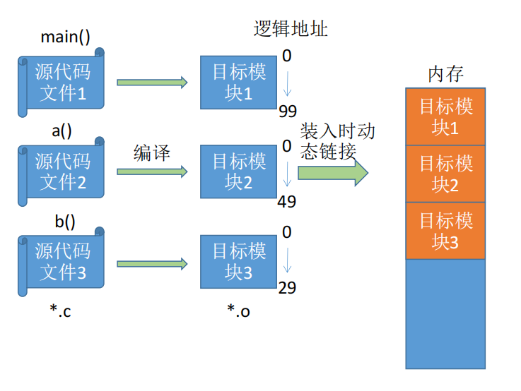
   
3. 运行时动态链接：在程序执行中需要该目标模块时，才对它进行链接。其优点是便于修改和更新，便于实现对目标模块的共享。
   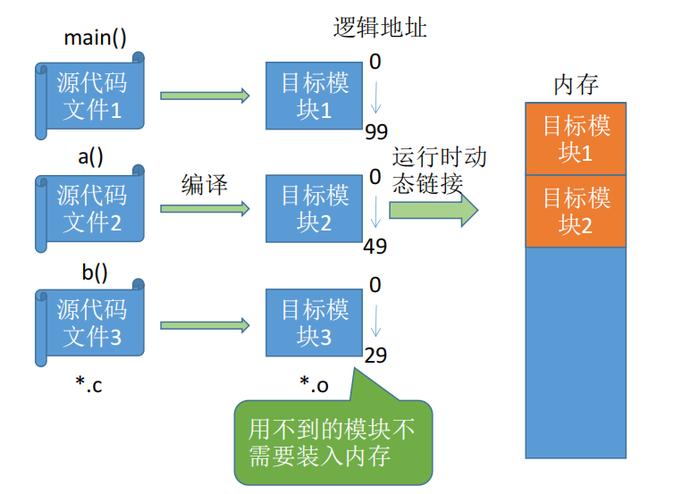

### 1.1.3 装入的三种方式

1. 绝对装入：在编译时，如果知道程序将放到内存中的哪个位置，编译程序将产生绝对地址的目标代码。装入程序按照装入模块中的地址，将程序和数据装入内存。
   如果知道装入模块要从地址为 100 的地方开始存放：
   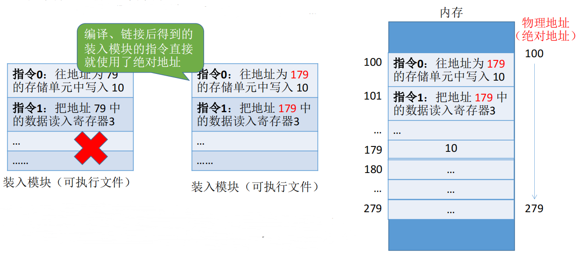

   绝对装入只适用于单道程序环境。
   程序中使用的绝对地址，可在编译或汇编时给出，也可由程序员直接赋予。通常情况下都是编译或汇编时再转换为绝对地址。
2. 静态重定位：又称`可重定位装入`。`编译、链接后的装入模块的地址都是从0开始的`，`指令中使用的地址、数据存放的地址都是相对于起始地址而言的逻辑地址`。`可根据内存的当前情况，将装入模块装入到内存的适当位置`。`装入时对地址进行“重定位”，将逻辑地址变换为物理地址`（地址变换是在装入时一次完成的）。
   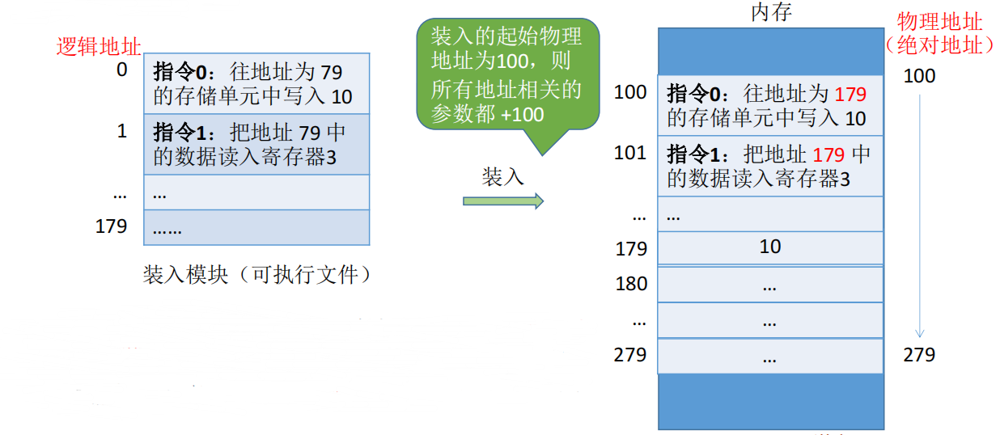

   静态重定位的特点是在一个作业装入内存时，必须分配其要求的全部内存空间，如果没有足够的内存，就不能装入该作业。 作业一旦进入内存后，在运行期间就不能再移动，也不能再申请内存空间。
3. 动态重定位：又称`动态运行时装入`。`编译、链接后的装入模块的地址都是从0开始的`。`装入程序把装入模块装入内存后，并不会立即把逻辑地址转换为物理地址，而是把地址转换推迟到程序真正要执行时才进行`。因此`装入内存后所有的地址依然是逻辑地址`。这种方式需要一个`重定位寄存器`的支持。
   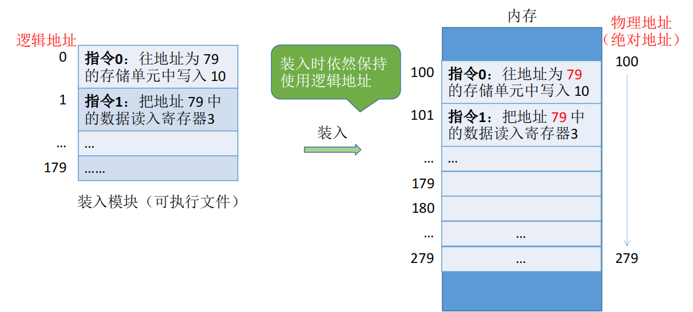

   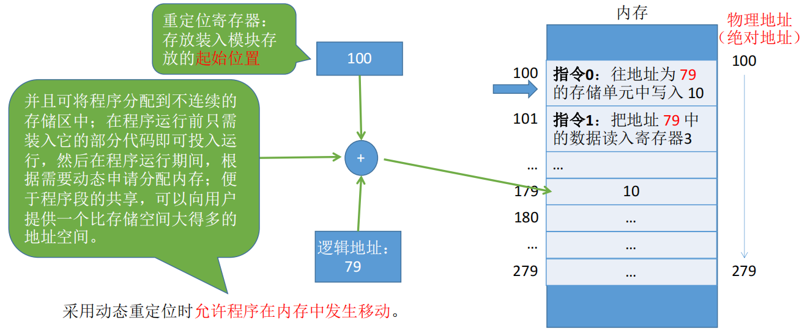

## 1.2 内存管理基本概念

内存管理的职责：
1. 内存空间的分配和回收
2. 内存空间的扩充
3. 地址转换：操作系统负责实现逻辑地址到物理地址的转换
   1. 绝对装入：编译器负责地址转换（单道程序阶段，无操作系统）
   2. 可重定位装入：装入程序负责地址转换（早期多道批处理阶段）
   3. 动态运行时装入：运行时才进行地址转换（现代操作系统）
4. 存储保护：保证各进程在各自存储空间内运行，互不干扰

## 1.3 存储保护

存储保护：保证各进程在各自存储空间内运行，互不干扰

存储保护的方法：
1. 在CPU中设置上下限寄存器，存放进程的上、下限地址。。进程的指令要访问某个地址时，CPU检查是否越界。
   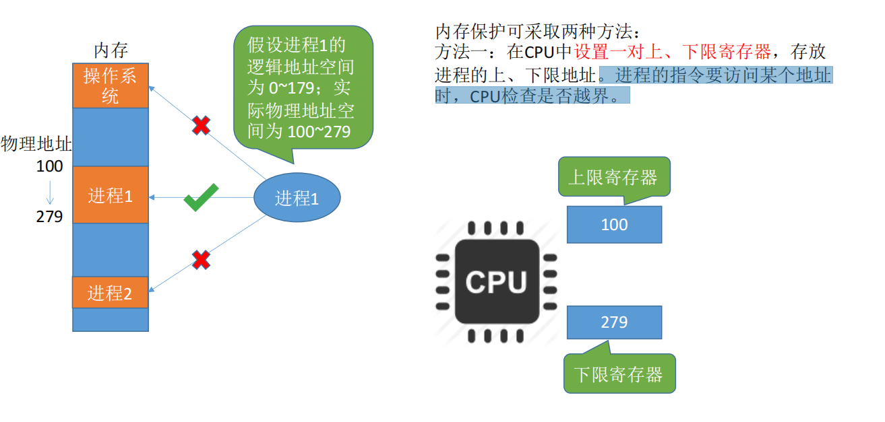
2. 采用`重定位寄存器`（又称`基址寄存器`）和`界地址寄存器`（又称`限长寄存器`）进行越界检查。`重定位寄存器中存放的是进程的起始物理地址。界地址寄存器中存放的是进程的最大逻辑地址`。
   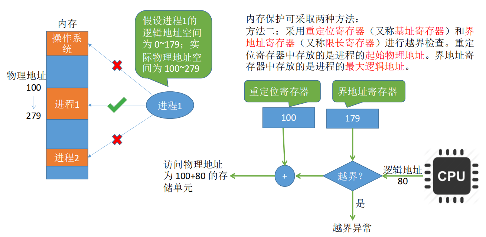

## 1.4 内存空间的扩充

内存空间的扩充的实现采用如下几种技术：
1. 覆盖技术
2. 交换技术
3. 虚拟存储技术

### 1.4.1 覆盖技术

覆盖技术用来解决“程序大小超过物理内存总和”的问题。

覆盖技术的思想：将程序分为多个段（多个模块）。常用的段常驻内存，不常用的段在需要时调入内存。

内存中分为一个“固定区”和若干个“覆盖区”。

`需要常驻内存的段放在“固定区”中，调入后就不再调出（除非程序运行结束）。不常用的段放在“覆盖区”，需要用到时调入内存，用不到时调出内存。`

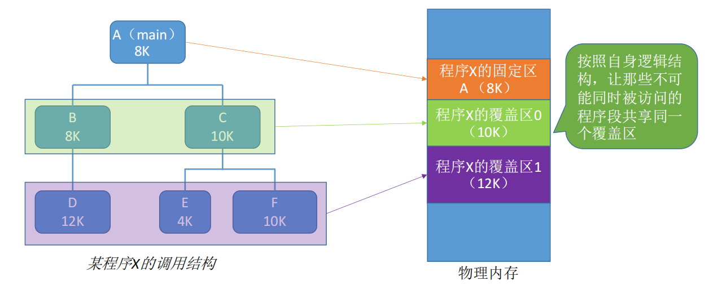

`缺点`：必须由程序员声明覆盖结构，操作系统自动完成覆盖。对用户不透明，增加了用户编程负担。

### 1.4.2 交换技术

交换技术的设计思想：内存空间紧张时，系统将内存中某些进程暂时换出外存，把外存中某些已经具备运行条件的进程换入内存（进程在内存与磁盘间动态调度）。

中级调度（内存调度），就是要决定哪个处于挂起状态的进程重新调入内存。

暂时换出外存等待的进程状态为挂起状态（挂起态，suspend）

挂起态又可以进一步细分为就绪挂起、阻塞挂起两种状态

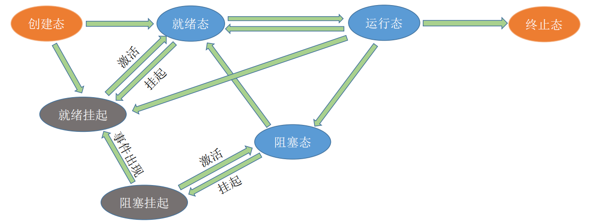

1. 具有对换功能的操作系统中，通常把磁盘空间分为文件区和对换区两部分。文件区主要用于存放文件，主要追求存储空间的利用率，因此对文件区空间的管理采用离散分配方式；对换区空间只占磁盘空间的小部分，被换出的进程数据就存放在对换区。由于对换的速度直接影响到系统的整体速度，因此对换区空间的管理主要追求换入换出速度，因此通常对换区采用连续分配方式（学过文件管理章节后即可理解）。总之，对换区的I/O速度比文件区的更快。
2. 交换通常在许多进程运行且内存吃紧时进行，而系统负荷降低就暂停。例如：在发现许多进程运行时经常发生缺页，就说明内存紧张，此时可以换出一些进程；如果缺页率明显下降，就可以暂停换出。
3. 可优先换出阻塞进程；可换出优先级低的进程；为了防止优先级低的进程在被调入内存后很快又被换出，有的系统还会考虑进程在内存的驻留时间（注意：PCB 会常驻内存，不会被换出外存）。

## 1.5 内存空间的分配与回收

### 1.5.1 连续分配管理方式

1. 单一连续分配：在单一连续分配方式中，内存被分为`系统区`和`用户区`。系统区通常位于内存的低地址部分，用于存放操作系统