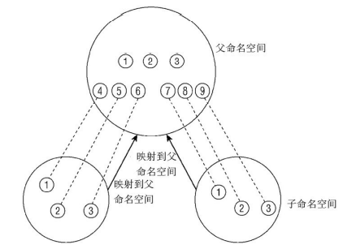

## 2. 进程管理和调度

在多处理器系统中，可以真正并行运行的进程数目，取决于物理CPU的数目。

### 2.1 进程优先级

并非所有的进程都具有相同的重要性。除了进程优先级之外，进程还有不同的关键度类别，以满足不同需求。首先进行比较粗糙的划分，进程可分为实时进程和非实时进程。

实时进程又可以分为软实时进程和硬实时进程。

- 硬实时进程：其关键特征是，`他们必须在可保证的时间范围内得到处理，系统必须保证绝不会超过某一特定时间范围`。
- 软实时进程：软实时进程是硬实时进程的一种弱化形式。`尽管仍然需要快速得到结果，但稍微晚一点不会造成极其严重的后果。`


Linux不支持硬实时处理，至少在主流的内核中不支持，但有一些修改版本提供了该特性。在这些修改后的方案中，Linux内核作为独立的“进程”运行来处理次重要的软件，而实时的工作则在内核外部完成。只有当没有实时的关键操作执行时，内核才会运行。

大多数进程是没有特定时间约束的`普通进程`，但`仍然可以根据重要性来分配优先级`。

为了实现进程优先级的功能，`进程的运行按时间片调度，分配给进程的时间片份额与其相对重要性相当`。系统中时间的流动对应于圆盘的转动，而CPU则由圆周旁的“扫描器”表示。最终效果是，`尽管所有的进程都有机会运行，但重要的进程会比次要的得到更多的CPU时间`。


这种方案称之为`抢占式多任务处理`，`各个进程都分配到一定的时间段可以执行。时间段到期后，内核会从进程收回控制权，让一个不同的进程运行，而不考虑前一进程所执行的上一个任务。被抢占进程的运行时环境，即所有CPU寄存器的内容和页表，都会保存起来，因此其执行结果不会丢失。在该进程恢复执行时，其进程环境可以完全恢复。时间片的长度会根据进程重要性（以及因此而分配的优先级）的不同而变化`。

但这种简化模型没有考虑到几个重要问题：
1. 进程在某些时间可能因为无事可做而无法立即执行
2. Linux支持不同的调度类别（在进程之间完全公平的调度和实时调度），调度时必须考虑这点。

### 2.2 进程生命周期

进程并不总是可以立即运行，有时候它必须等待来自外部信号源、不受其控制的事件。当调度器在进程之间切换时，必须直到系统中每个进程的状态。

进程可能有下面的几种状态：
1. 运行：该进程此刻正在执行。
2. 等待：进程能够运行，但没有得到许可，因为CPU分配给另一个进程。调度器可以在下一次任务切换时选择该进程。
3. 睡眠：进程正在睡眠无法运行，因为它在等待一个外部事件。调度器无法在下一次任务切换时选择该进程。

系统将所有进程保存在一个进程表中，无论其状态是运行、睡眠或等待。但睡眠进程会特别标记出来，调度器会知道它们无法立即运行。睡眠进程会分类到若干队列中，因此它们可以在适当的时间唤醒。


对于一个排队中的可运行进程，考察其各种可能的状态转换。
1. 该进程已经就绪，但没有运行，因为CPU分配给了其他进程（此时该进程的状态是“等待”）。在调度器授予CPU时间之前，进程会一直保持该状态。在分配CPU时间之后，其状态改变为“运行”（④）。
2. 在调度器决定从该进程收回CPU资源时，进程状态从“运行”改变为“等待”（②），循环重新开始。
3. 如果进程必须等待事件，则其状态从“运行”改变为“睡眠”（①）。实际上根据是否可以被信号中断，有两种“睡眠”状态。
4. 进程状态无法从“睡眠”直接改变为“运行”。在所等待的事件发生后，进程先变回到“等待”状态（③），然后重新回到正常状态。
5. 在程序执行终止后，过程状态由“运行”变为“终止”（⑤）。

除此之外，还有一个特殊的进程状态，`就是所谓的“僵尸”状态`。`这样的进程已经死亡，其资源（内存、与外设的连接等等）已经释放，但是进程表中仍然有对应的表项。`

僵尸进程产生是由于UNIX操作系统下进程创建和销毁的方式。在两种事件发生时，程序将终止运行：
1. 程序必须由另一个进程或一个用户杀死（通常是通过发送SIGTERM或SIGKILL信号来完成，这等价于正常地终止进程）。
2. 进程的父进程在子进程终止时必须调用或已经调用wait4（读作wait for）系统调用。

只有在第一个条件发生（程序终止）而第二个条件不成立的情况下（wait4），才会出现“僵尸”状态。在进程终止之后，其数据尚未从进程表删除之前，进程总是暂时处于“僵尸”状态。

#### 2.2.1 抢占式多任务处理

Linux进程管理的结构中需要两种进程状态选项：用户态和内核态。

进程通常都处于用户状态，只能访问自身的数据，无法干扰系统中的其他应用程序如果想要访问系统数据或功能（后者管理着所有进程之间共享的资源），则必须切换到核心态。切换到核心态的一种方式是系统调用，另一种方式是通过中断。

`通过中断切换到核心态，这种切换时自动触发的`。`处理中断的操作通常与中断发生时执行的进程无关。因此，Linux执行中断操作时，当前运行的进程不会察觉`。

`内核的抢占调度模型建立了一个层次结构，用于判断哪些进程状态可以由其他状态抢占`：

1. `普通进程总是可能被抢占，甚至是由其他进程抢占。在一个重要进程变为可运行时，调度器可以决定是否立即执行该进程。对于实现良好的交互行为和低系统延迟，这种抢占起到了重要作用`。
2. `如果系统处于核心态并正在处理系统调用，那么系统中的其他进程是无法夺取其CPU时间的。调度器必须等待程序执行结束，才能选择另一个进程执行，但中断可以中止系统调用`。
3. `中断可以暂停处于用户态和核心态的进程。中断具有最高优先级，因为在中断触发后需要尽快处理`。

在内核2.5开发期间，`内核抢占选项被添加到内核中。该选项支持在紧急情况下切换为另一个进程，甚至当前是处于核心态执行系统调用（中断处理期间是不行的）。尽管内核会试图尽快执行系统调用，但对于以来恒定数据流的应用程序来说，系统调用所需的时间太长了。内核抢占可以减少这样的等待时间，因而保证“更平滑的”程序执行。但该特性的代价是增加内核的复杂度`。


### 2.3 进程表示


Linux内核涉及进程和程序的所有算法都围绕一个名为`task_struct的数据结构（即PCB）`建立，该结构定义在`include/sched.h`中。

task_struct中数据过多，但可以分解为各个部分：
1. 状态和执行信息，如待决信号、使用的二进制格式（和其他系统二进制格式的任何仿真信息）、进程ID号（pid）、到父进程及其他有关进程的指针、优先级和程序执行有关的时间信息（例如CPU时间）。
2. 有关已分配的虚拟内存的信息。
3. 进程身份凭据，如用户ID、组ID以及权限等。可使用系统调用查询（或修改）这些数据。
4. 使用的文件。包含程序代码的二进制文件，以及进程所处理的所有文件的文件系统信息。
5. 线程信息。记录该进程特定于CPU的运行时间数据（该结构的其余字段与所使用的硬件无关）。
6. 在与其他应用程序协作时所需的进程间通信有关的信息。
7. 该进程所用的信号处理程序，用于影响到来的信号。

接下来简单阐述task_struct中对进程管理的实现特别重要的一些成员：
1. state制定了进程的当前状态，可使用下列值（定义在<sched.h>）：
   - TASK_RUNNING：进程处于可运行状态（就绪态）。这并不意味着已经实际分配了CPU。进程可能会一直等到调度器选中它。。该状态确保进程可以立即运行，而无需等待外部事件。
   - TASK_INTERRUPTIBLE：等待某事件或其他资源。在内核发送信号给该进程表示事件已经发生时，进程状态变为TASK_RUNNING，它只要调度器选中该进程即可恢复执行。
   - TASK_UNINTERRUPTIBLE：用于因内核指示而停用的睡眠进程。它们不能由外部信号唤醒，只能由内核亲自唤醒。
   - TASK_STOPPED：别欧式进程特意停止运行，例如，由调试器暂停。
   - TASK_TRACED：本来不是进程状态，用于从停止的进程中，将当前被调试的那些（使用ptrace机制）与常规的进程区分开来。
  
   下列常量既可以用于struct task_struct的进程状态字段，也可以用于exit_state字段，后者明确地用于退出进程。
   - EXIT_ZOMBIE如上述的僵尸状态。
   - EXIT_DEAD状态则是指wait系统调用已经发出，而进程完全从系统一处之前的状态。只有多个线程对同一个进程发出wait调用时，该状态才有意义。
2. Linux提供了资源限制机制，对进程使用系统资源施加某些限制。该机制利用了task_struct中的rlim数组，数组项类型为`struct rlimit`。其定义在<resource.h>文件中。
   ```c
   struct rlimit {
      unsigned long rlim_cur;
      unsigned long rlim_max;
   }
   ```
   这种通用的设计可以用于许多不同的资源类型：
   - `rlim_cur`是`进程当前的资源限制`，也称之为`软限制`。
   - `rlim_max`是`限制的最大容许值`，因此也称之为`硬限制`。
  系统调用setrlimit来增减当前限制，但不能超出rlim_max指定的值。getrlimits用于检查当前限制。

  rlim数组中的位置表示了受限资源的类型，也这是内核需要定义预处理器常数。常量表如下：
  |常数|语义|
  |---|---|
  |RLIMIT_CPU|按毫秒计算的最大CPU时间|
  |RLIMIT_FSIZE|允许的最大文件长度|
  |RLIMIT_DATA|数据段的最大长度|
  |RLIMIT_STACK|（用户状态）栈的最大长度|
  |RLIMIT_CORE|内存转储文件的最大长度|
  |RLIMIT_RSS|常驻内存的最大尺寸，换句话说，进程使用页帧的最大数目。目前未使用。|
  |RLIMIT_NPROC|与进程真正UID关联的用户可以拥有进程的最大数目|
  |RLIMIT_NOFILE|打开文件的最大数目|
  |RLIMIT_MEMLOCK|不可换出页的最大数目|
  |RLIMIT_AS|进程占用的虚拟地址空间的最大尺寸|
  |RLIMIT_LOCKS|文件锁的最大数目|
  |RLIMIT_SIGPENDING|待决信号的最大数目|
  |RLIMIT_MSGQUEUE|信息队列的最大数目|
  |RLIMIT_NICE|非实时进程的优先级（nice level）
  |RLIMIT_RTPRID|最大的实时优先级|

  如果某一类资源没有使用限制，则将rlim_max设置为RLIM_INFINITY。例外情况包含下面列举的：
  1. `打开文件的数目`（RLIMIT_NOFILE，`默认限制为1024`）。
  2. `每个用户的最大进程数`（RLIMIT_NPROC），定义为max_threads/2。`max_threads是一个全局变量`，指定了`在把八分之一可用内存用于管理线程信息的情况下，可以创建的线程数目`。在计算时，`提前给定了20个线程的最小可能内存用量`。

#### 2.3.1 进程类型

典型的UNIX进程包括：
1. 由二进制代码组成的应用程序
2. 单线程（计算机沿单一路径通过代码，不会有其他路径同时运行）
3. 分配给应用程序的一组资源（如内存，文件等）

新进程是使用fork和exec系统调用产生的：
1. fork生成当前进程的一个相同副本，该副本即为子进程。原进程都以适当的方式复制到子进程。
2. exec从一个可执行的二进制文件加载另一个应用程序，来代替原来运行的进程。注意，exec并不创建新进程，所以必须先使用fork复制一个旧的程序，再调用exec系统调用。

上述两个系统调用在UNIX操作系统变体上都是可用的，除此之外，Linux还提供了clone系统调用，`clone的工作原理基本上与fork相同，但新进程不是独立于父进程的，而可以与其共享某些资源。可以指定需要共享和复制的资源种类`。

clone用于实现线程，但仅仅该系统调用不足以做到这一点，还需要用户空间库才能提供完整的实现。

#### 2.3.2 命名空间

命名空间提供了虚拟化的一种轻量级形式。传统上，Linux以及其他衍生的UNIX变体中，许多资源是全局管理的。但有些情况下，需要果提供Web主机的供应商打算向用户提供Linux计算机的全部访问权限，包括root权限在内。

传统上，可以通过KVM、VMWare提供的虚拟化环境解决问题，但过于重量级（计算机的各个用户都需要一个独立的内核，以及一份完全安装好的配套的用户层应用）。

命名空间提供了一种所需资源较少的解决方案，操作系统的全局资源都通过命名空间抽象起来，使得可以将一组进程放置到容器中，各个容器彼此隔离。隔离可以使容器的成员与其他容器毫无关系。但也可以通过允许容器进行一定的共享，来降低容器之间的分隔。但`多个容器是运行在一个内核下的（虚拟机则是运行在多个内核下的）`。

本质上，命名空间建立了系统的不同视图，全局数据包装到容器的数据结构中，`只有资源和包含资源的命名空间构成的二元组仍然是全局唯一的。虽然在给定容器内部资源是自足的，但无法提供在容器外部具有唯一性的ID。`



`命名空间可以按照层次关联起来。每个命名空间都发源于一个父命名空间，一个父命名空间可以有多个子命名空间`。

考虑系统上有3个不同命名空间的情况。命名空间可以组织为层次，我会在这里讨论这种情况。一个命名空间是父命名空间，衍生了两个子命名空间。假定容器用于虚拟主机配置中，其中的每个容器必须看起来像是单独的一台Linux计算机。因此其中每一个都有自身的init进程，PID为0，其他进程的PID以递增次序分配。两个子命名空间都有PID为0的init进程，以及PID分别为2和3的两个进程。由于相同的PID在系统中出现多次，PID号不是全局唯一的。

虽然子容器不了解系统中的其他容器，但父容器知道子命名空间的存在，也可以看到其中执行的所有进程。图中子容器的进程映射到父容器中，PID为4到9。尽管系统上有9个进程，但却需要15个PID来表示，因为一个进程可以关联到多个PID。至于哪个PID是“正确”的，则依赖于具体的上下文（`只有资源和包含资源的命名空间构成的二元组仍然是全局唯一的。虽然在给定容器内部资源是自足的，但无法提供在容器外部具有唯一性的ID`）。

如果命名空间包含的是比较简单的量，也可以是非层次的。例如UTS命名空间。Linux支持简单形式的命名空间很久了。主要是chroot系统调用，该方法可以将进程限制到文件系统的一部分。

新的命名空间可以按照如下两种方式创建：
1. 在用fork和clone系统调用创建新进程时，有特定的选项可以控制是与父进程共享命名空间，还是创建一个新的命名空间。
2. unshare系统调用将进程的某些部分从父进程分离，其中也包括命名空间。

在进程已经使用上述的两种机制之一从父进程命名空间分离后，从该进程的角度来看，改变全局属性不会传播到父进程命名空间，而父进程的修改也不会传播到子进程，至少对于简单的量是这样。而对于文件系统来说，情况就比较复杂。  

`命名空间的实现`需要`两个部分`：
1. `每个子系统的命名空间结构，将全局组件包装到命名空间中`；
2. `将给定进程关联到所属各个命名空间的机制`。


子系统内的全局属性现在封装到命名空间中，每个进程关联到一个选定的命名空间。每个可以感知命名空间的内核子系统都必须提供一个数据结构，将所有通过命名空间形式提供的对象集中起来。struct nsproxy（<nsproxy.h>）用于汇集指向特定于子系统的命名空间包装器的指针：

```c
struct nsproxy {
   atomic_t count;
   struct uts_namespace *uts_ns;
   struct ipc_namespace *ipc_ns;
   struct mnt_namespace *mnt_ns;
   struct pid_namespace *pid_ns;
   struct user_namespace *user_ns;
   struct net *net_ns;
}
```

- UTS命名空间包含了运行内核的名称、版本、底层体系结构类型等信息。UTS是UNIX Timesharing System的简称。
- 保存在struct ipc_namespace中的所有与进程间通信（IPC）有关的信息。
- 已经装载的文件系统的视图，在struct mnt_namespace中给出。
- 有关进程ID的信息，由struct pid_namespace提供。
- struct user_namespace保存的用于限制每个用户资源使用的信息。
- struct net_ns包含所有网络相关的命名空间参数。

在创建新进程时，可以通过提供适当的标志选项（<sched.h>），使用fork创建一个新的命名空间：

```c
// 创建新的utsname组
#define CLONE_NEWUTS 0x04000000  

// 创建新的IPC命名空间 
#define CLONE_NEWIPC 0x08000000  

// 创建新的用户命名空间
#define CLONE_NEWUSER 0x10000000  

// 创建新的PID命名空间
#define CLONE_NEWPID 0x20000000  

// 创建新的网络命名空间
#define CLONE_NEWnet 0x40000000  
```

每个进程都通过nsproxy属性关联到自身的命名空间视图（<sched.h>）：

```c
struct task_struct {
   ...
   // 命名空间
   struct nsproxy *nsproxy;
   ...
}
```
注意，对命名空间的支持必须在编译时启用，